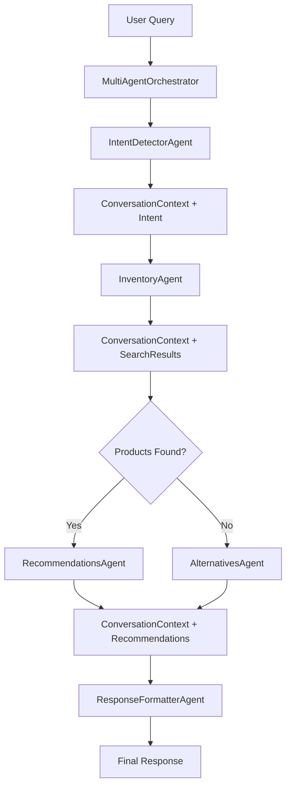
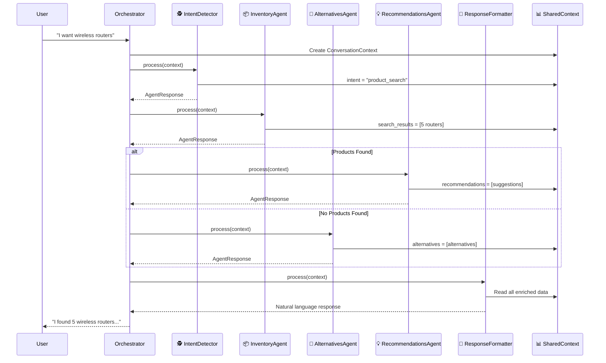

# 🤖 Multi-Agent Retail Assistant

A sophisticated **custom-built multi-agent orchestration system** for retail customer assistance, integrating Azure Cognitive Search and Azure OpenAI services. This system demonstrates advanced multi-agent architecture without relying on heavyweight frameworks like LangChain, AutoGen, or CrewAI.

## 🏗️ Framework & Architecture Overview

### **Framework Approach: Custom Multi-Agent Orchestration**

This system implements a **custom sequential orchestration pattern** where agents communicate indirectly through a shared context object, providing simplicity and control while maintaining enterprise-level capabilities.

#### **Core Technologies Stack:**
- **Python asyncio** - Asynchronous processing for optimal performance
- **Pydantic** - Data models and type validation
- **Azure OpenAI Service** - Large Language Model capabilities
- **Azure Cognitive Search** - Product search and retrieval
- **Rich Console** - Enhanced CLI interface with beautiful formatting

#### **Agent Communication Technique: Shared Context Pattern**

**Unlike framework-based solutions**, agents don't communicate directly with each other. Instead, they use a **shared ConversationContext object** that gets enriched as it flows through the pipeline:

```python
class ConversationContext(BaseModel):
    user_query: UserQuery
    intent: Optional[Intent] = None           # Set by IntentDetector
    search_results: Optional[SearchResult] = None  # Set by InventoryAgent
    recommendations: List[Recommendation] = []      # Set by RecommendationsAgent
    conversation_history: List[str] = []
```

#### **Sequential Processing Pipeline:**



### **Architecture Advantages**

| Aspect | Custom Architecture | LangChain | AutoGen | CrewAI |
|--------|-------------------|-----------|---------|---------|
| **Complexity** | ✅ Low | ⚠️ Medium | ❌ High | ⚠️ Medium |
| **Agent Communication** | ✅ Shared Context | 🔄 Various patterns | 💬 Direct messaging | 👥 Role-based |
| **Dependencies** | ✅ Minimal | ❌ Heavy | ❌ Heavy | ⚠️ Medium |
| **Learning Curve** | ✅ Low | ⚠️ Medium | ❌ High | ⚠️ Medium |
| **Flexibility** | ✅ High | ⚠️ Medium | ✅ High | ⚠️ Medium |
| **Performance** | ✅ Lightweight | ⚠️ Overhead | ❌ Heavy | ⚠️ Moderate |
| **Debugging** | ✅ Transparent | ⚠️ Complex | ❌ Difficult | ⚠️ Moderate |

## 🎯 Multi-Agent System Architecture

### **5 Specialized AI Agents Working in Harmony:**

#### **1. 🕵️ IntentDetectorAgent**
- **Purpose**: Analyzes user queries to determine intent and extract entities
- **Input**: Raw user query
- **Output**: Intent classification (product_search, recommendation, general_inquiry)
- **Technology**: Rule-based pattern matching with confidence scoring

#### **2. 📦 InventoryAgent**
- **Purpose**: Searches product inventory using Azure Cognitive Search
- **Input**: Search intent and query from IntentDetector
- **Output**: Product search results with relevance scoring
- **Technology**: Azure Cognitive Search with hybrid search capabilities

#### **3. 🔄 AlternativesAgent**
- **Purpose**: Finds smart alternatives when requested items are unavailable
- **Input**: Failed search results or explicit alternative requests
- **Output**: Alternative product suggestions with reasoning
- **Technology**: Semantic search and similarity matching

#### **4. 💡 RecommendationsAgent**
- **Purpose**: Provides AI-powered product suggestions and enhancements
- **Input**: Found products and user context
- **Output**: Personalized recommendations with explanations
- **Technology**: Azure OpenAI with product knowledge base

#### **5. 📝 ResponseFormatterAgent**
- **Purpose**: Creates natural, conversational responses from technical data
- **Input**: All agent outputs and conversation context
- **Output**: Human-friendly formatted response
- **Technology**: Azure OpenAI with custom prompting

### **🎯 Core Design Patterns:**

#### **1. Orchestrator Pattern**
- Central `MultiAgentOrchestrator` manages all agent interactions
- No direct agent-to-agent communication (reduces complexity)
- Deterministic processing order with clear data flow

#### **2. Shared Memory Pattern**
```python
# Session context persists across interactions
self.session_context = {
    "products_shown": set(),           # Avoid repetition
    "categories_explored": set(),      # Track user interests
    "alternative_requests": [],        # Handle follow-ups
    "user_preferences": {},           # Learn user behavior
    "conversation_history": [],       # Maintain context
}
```

#### **3. Context Enrichment**
Each agent enriches the shared context in sequence:
- **Intent Detector** → Adds `intent` classification
- **Inventory Agent** → Adds `search_results` with products
- **Alternatives/Recommendations** → Adds `suggestions` and `alternatives`
- **Response Formatter** → Creates final `response_text`

## ✨ Enhanced Features

### **🤖 Advanced Multi-Agent Capabilities**
- **5 Specialized AI Agents** working in perfect harmony
- **Custom orchestration** without heavyweight framework dependencies
- **Sequential processing pipeline** with shared context communication
- **Smart agent selection** based on inventory availability

### **� Advanced Conversation Memory**
- **Session persistence** across multiple interactions
- **Context-aware responses** that remember previous conversations
- **Smart confirmatory handling** ("yes" means show the routers we discussed)
- **Avoids repetition** by tracking products already shown

### **🔄 Smart Context Switching**
- **Confirmatory response detection** (yes, no, sure, okay)
- **Pending action management** for natural conversation flow
- **Follow-up query handling** with conversation context
- **Intelligent fallback** when no products are found

### **⚡ Real Azure Service Integration**
- **Azure Cognitive Search** for live inventory queries
- **Azure OpenAI Service** for natural language processing
- **Hybrid search capabilities** (vector + keyword search)
- **Real-time product recommendations** from live data

### **🎨 Beautiful Console Interface**
- **Rich terminal formatting** with colors and panels
- **Progress indicators** showing agent processing steps
- **Structured data tables** for product information
- **Session analytics** and conversation summaries

### **🏗️ Production-Ready Architecture**
- **Async/await patterns** for optimal performance
- **Comprehensive error handling** with graceful fallbacks
- **Detailed logging system** for debugging and monitoring
- **Modular design** for easy extension and maintenance
- **Type safety** with Pydantic data models
- **Configuration management** via environment variables

## Setup Instructions

### 1. Install Dependencies

```bash
pip install -r requirements.txt
```

### 2. Configure Azure Services

Update the `.env` file with your Azure credentials:

```env
# Azure OpenAI Configuration
AZURE_OPENAI_ENDPOINT=https://your-openai-resource.openai.azure.com/
AZURE_OPENAI_KEY=your_openai_api_key_here
AZURE_OPENAI_DEPLOYMENT_NAME=gpt-4
AZURE_OPENAI_API_VERSION=2023-12-01-preview

# Azure Search Configuration  
AZURE_SEARCH_ENDPOINT=https://your-search-service.search.windows.net
AZURE_SEARCH_KEY=your_search_api_key_here
AZURE_SEARCH_INDEX=retail-index
```

### 3. Run the Application

**Interactive Mode:**
```bash
python main.py
```

**Test Mode:**
```bash
python test_app.py
```

**Run Tests:**
```bash
pytest tests/
```

## 📁 Project Structure

```
Multi_Agent_App/
├── 🎯 CORE APPLICATION
│   ├── main.py                          # 🚀 Main orchestrator application with enhanced UI
│   ├── test_app.py                      # 🧪 Simple test harness for agent validation
│   └── .env                             # ⚙️ Environment variables (Azure credentials)
│
├── 🤖 MULTI-AGENT SYSTEM
│   └── agents/
│       ├── __init__.py
│       ├── base_agent.py                # 🏗️ Abstract base class for all agents
│       ├── intent_detector.py           # 🕵️ Intent analysis and entity extraction
│       ├── inventory_agent.py           # 📦 Product search via Azure Cognitive Search
│       ├── alternatives_agent.py        # 🔄 Smart alternative suggestions
│       ├── recommendations_agent.py     # 💡 AI-powered recommendations
│       └── response_formatter.py        # 📝 Natural language response generation
│
├── 📊 DATA MODELS & SCHEMAS
│   └── models/
│       ├── __init__.py
│       └── data_models.py               # 📋 Pydantic models (UserQuery, Intent, Product, etc.)
│
├── 🔌 EXTERNAL SERVICE INTEGRATIONS
│   └── services/
│       ├── __init__.py
│       ├── azure_search_service.py      # 🔍 Azure Cognitive Search integration
│       └── openai_service.py            # 🧠 Azure OpenAI Service wrapper
│
├── ⚙️ CONFIGURATION & UTILITIES
│   ├── config/
│   │   ├── __init__.py
│   │   └── settings.py                  # 🔧 Environment-based configuration
│   └── utils/
│       ├── __init__.py
│       └── helpers.py                   # 🛠️ Logging, validation, and utility functions
│
├── 🧪 COMPREHENSIVE TEST SUITE
│   └── tests/
│       ├── __init__.py
│       ├── test_all.py                  # 🎯 Complete integration tests
│       ├── test_agents.py               # 🤖 Individual agent unit tests
│       ├── test_intent.py               # 🕵️ Intent detection validation
│       ├── test_models.py               # 📊 Data model validation
│       ├── test_pipeline.py             # 🔄 End-to-end pipeline tests
│       ├── test_search.py               # 🔍 Search functionality tests
│       └── test_services.py             # 🔌 External service integration tests
│
├── 📚 DOCUMENTATION & SETUP
│   ├── README.md                        # 📖 This comprehensive guide
│   ├── requirements.txt                 # 📦 Python dependencies
│   └── create_multi_agent_structure.ps1 # ⚡ PowerShell setup script
```

### **🎯 Key Architecture Components:**

#### **🎮 MultiAgentOrchestrator (main.py)**
- Central control system managing all agent interactions
- Enhanced conversation memory and session context
- Beautiful Rich console interface with progress indicators
- Confirmatory response handling and smart context switching

#### **🤖 Agent Pipeline Flow**
```python
# Sequential agent processing with shared context enrichment
async def process_query(self, user_query: str) -> str:
    # 1️⃣ Intent Detection
    intent_result = await self.intent_detector.process(context)
    
    # 2️⃣ Inventory Search
    inventory_result = await self.inventory_agent.process(context)
    
    # 3️⃣ Smart Decision: Products Found?
    if products_found > 0:
        # ✅ Show products + recommendations
        recommendations = await self.recommendations_agent.process(context)
    else:
        # 🔄 Find alternatives
        alternatives = await self.alternatives_agent.process(context)
    
    # 4️⃣ Natural Language Response
    final_response = await self.response_formatter.process(context)
```

#### **📊 Shared Data Flow**
```python
# Context object enriched by each agent in sequence
ConversationContext:
    user_query: UserQuery          # Input from user
    intent: Intent                 # ← IntentDetectorAgent
    search_results: SearchResult   # ← InventoryAgent  
    recommendations: List[Rec]     # ← RecommendationsAgent
    conversation_history: List     # ← Session memory
```

## 🎭 Usage Examples & Conversation Flow

### **🔍 Product Search with Smart Inventory Handling**

```
User: "I'm looking for wireless routers"
🤖 Processing your request...
🕵️ Detected intent: product_search (confidence: 0.9)
📦 Products found in inventory: 5
✅ Found 5 products in stock!

🤖 Assistant: I found 5 wireless routers in our inventory! Here are the top options:

📦 Contoso 5G Router Pro - $199.99
   High-speed 5G connectivity, perfect for home office
   
📦 Fabrikam Mesh Router System - $299.99  
   Whole-home coverage with mesh technology
   
Would you like more details about any of these routers?
```

### **🔄 Smart Alternative Suggestions (When Items Unavailable)**

```
User: "do you have drones?"
🤖 Processing your request...
🕵️ Detected intent: product_search (confidence: 0.9)
📦 Products found in inventory: 0
🔍 No exact matches found, looking for alternatives...

🤖 Assistant: I don't have drones in stock right now, but I found some great alternatives that might interest you:

🔄 Action Cameras - $149.99
   Perfect for aerial-like footage and adventures
   
🔄 RC Helicopters - $89.99
   Flying experience with remote control fun
   
Would you like to see these alternatives, or shall I help you find something else?
```

### **💭 Enhanced Conversation Memory & Context**

```
User: "show me routers"
🤖 Assistant: [Shows 5 router options]

User: "yes"  
🧠 Detected confirmatory response: 'yes'
🧠 Resolved to action: 'show me routers'  
💭 Session memory: 5 products shown, 1 categories explored

🤖 Assistant: I already showed you those routers! Here are the details again:
[Shows router details with context awareness]

User: "something else"
🧠 Context-aware query: Following up on previous suggestions
🔄 Finding alternatives to avoid repetition...
```

### **📊 Session Analytics & Memory Tracking**

```
User: "summary"

📊 Session Summary:
• Duration: 5.2 minutes
• Total queries: 8
• Found products queries: 3  
• Alternative requests: 2
• Confirmatory responses: 1
• Unique products shown: 12
• Categories explored: 3 (routers, electronics, accessories)
• Last search query: wireless routers

📝 Recent conversation:
• [found_products] show me routers → (5 products) I found 5 wireless routers...
• [alternatives] something else → (3 products) Here are some alternatives...  
• [confirmatory] yes → (0 products) I already showed you those routers...
```

## 🔄 Multi-Agent Communication Technique

### **Shared Context Pattern (No Direct Agent Communication)**

Unlike framework-based solutions, our agents communicate through a **shared ConversationContext object**:

```python
# Agents don't send messages to each other
# They enrich a shared context object that flows through the pipeline

class ConversationContext(BaseModel):
    # Input
    user_query: UserQuery
    conversation_history: List[str] = []
    
    # Enriched by IntentDetectorAgent  
    intent: Optional[Intent] = None
    
    # Enriched by InventoryAgent
    search_results: Optional[SearchResult] = None
    
    # Enriched by RecommendationsAgent/AlternativesAgent  
    recommendations: List[Recommendation] = []

# Each agent reads from context, processes, and writes back
async def process(self, context: ConversationContext) -> AgentResponse:
    # Read from shared context
    user_query = context.user_query.text
    previous_intent = context.intent
    
    # Process with agent logic
    result = await self._agent_specific_processing(user_query)
    
    # Write back to shared context
    context.search_results = result
    
    return AgentResponse(...)
```

### **Sequential Processing Pipeline**

```python
# MultiAgentOrchestrator manages the sequential flow
async def process_query(self, user_query: str) -> str:
    # Create shared context
    context = ConversationContext(user_query=UserQuery(text=user_query))
    
    # Step 1: Intent Detection
    await self.intent_detector.process(context)
    # Context now has: context.intent = Intent(type="product_search")
    
    # Step 2: Inventory Search  
    await self.inventory_agent.process(context)
    # Context now has: context.search_results = SearchResult(products=[...])
    
    # Step 3: Smart Decision
    if context.search_results.products:
        # Products found - get recommendations
        await self.recommendations_agent.process(context)
        # Context now has: context.recommendations = [Recommendation(...)]
    else:
        # No products - find alternatives
        await self.alternatives_agent.process(context)
        # Context now has: context.alternatives = [Alternative(...)]
    
    # Step 4: Format Response
    final_result = await self.response_formatter.process(context)
    # Uses all context data to create natural language response
    
    return final_result.response_text
```

## 🎯 Agent Pipeline Flow



### **Key Architecture Benefits:**

✅ **Simplicity**: No complex inter-agent messaging protocols  
✅ **Transparency**: Clear data flow and easy debugging  
✅ **Performance**: Minimal overhead, lightweight processing  
✅ **Reliability**: Deterministic execution order  
✅ **Maintainability**: Easy to add/modify agents  
✅ **Testability**: Each agent can be unit tested independently  

## ⚙️ Configuration

The application uses environment variables for configuration. Key settings include:

- **Azure OpenAI**: Endpoint, API key, model deployment
- **Azure Search**: Endpoint, API key, index name
- **Application**: Log level, retry settings, timeouts

## Testing

Run the test suite:
```bash
# Run all tests
pytest tests/

# Run specific test file
pytest tests/test_agents.py

# Run with verbose output
pytest -v tests/
```

## Logging

The application logs conversations and system events to:
- Console output (configurable level)
- Log file: `multi_agent_app.log`

## Error Handling

- Graceful fallback for service failures
- Retry mechanisms with exponential backoff
- Comprehensive error logging
- User-friendly error messages

## Contributing

1. Fork the repository
2. Create a feature branch
3. Add tests for new functionality
4. Ensure all tests pass
5. Submit a pull request

## 🆚 Framework Comparison

### **Why Custom Architecture vs Popular Frameworks?**

| Feature | Custom (This Project) | LangChain | AutoGen | CrewAI |
|---------|----------------------|-----------|---------|---------|
| **Setup Complexity** | ✅ Simple | ⚠️ Complex | ❌ Very Complex | ⚠️ Moderate |
| **Dependencies** | ✅ ~10 packages | ❌ 50+ packages | ❌ 100+ packages | ⚠️ 30+ packages |
| **Performance** | ✅ Lightweight | ⚠️ Moderate overhead | ❌ Heavy | ⚠️ Moderate |
| **Learning Curve** | ✅ Low | ⚠️ Steep | ❌ Very Steep | ⚠️ Moderate |
| **Debugging** | ✅ Clear flow | ⚠️ Complex traces | ❌ Black box | ⚠️ Moderate |
| **Customization** | ✅ Full control | ⚠️ Framework constraints | ⚠️ Limited | ⚠️ Role-based |
| **Agent Communication** | ✅ Shared context | 🔄 Various patterns | 💬 Messages | 👥 Roles |
| **Production Ready** | ✅ Yes | ✅ Yes | ⚠️ Experimental | ⚠️ New |

### **When to Use Each Approach:**

#### **✅ Use This Custom Architecture When:**
- You need full control over agent behavior
- Performance and simplicity are priorities  
- Team prefers transparent, debuggable code
- Educational/learning purposes
- Specific business logic requirements

#### **⚠️ Consider Frameworks When:**
- **LangChain**: Need extensive LLM integrations and tools
- **AutoGen**: Building complex multi-agent conversations  
- **CrewAI**: Role-based agent collaboration patterns

## 🚀 Getting Started

Ready to explore this multi-agent system? Follow the setup instructions above and run:

```bash
python main.py
```

Experience the power of custom multi-agent orchestration! 🤖✨

## 📄 License

This project is licensed under the MIT License.