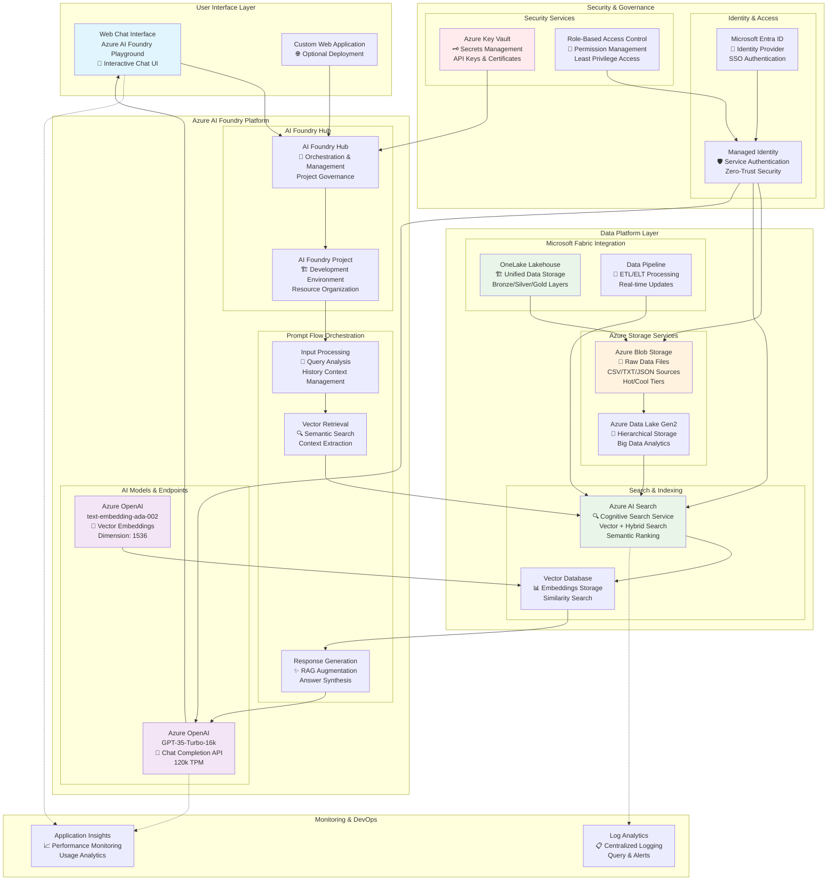

# 🚀 AI Hackathon - October 2025
**Dallas MTC AI Challenges - Building Intelligent Applications with Azure**

Welcome to the October 2025 AI Hackathon! This repository contains three comprehensive AI challenges designed to help you build modern AI applications using Azure services. Each challenge focuses on different aspects of AI development, from retrieval-augmented generation (RAG) to intelligent agents with database integration and advanced multi-agent systems.

## 📋 Table of Contents

- [🎯 Overview](#-overview)
- [🏗️ Repository Structure](#️-repository-structure)
- [⚙️ Prerequisites](#️-prerequisites)
- [🤖 AI Challenge 01: RAG ChatBot](#-ai-challenge-01-rag-chatbot)
- [🧠 AI Challenge 02: Intelligent Agent](#-ai-challenge-02-intelligent-agent)
- [� AI Challenge 03: Multi-Agent System](#-ai-challenge-03-multi-agent-system)
- [�📐 Architecture Diagrams](#-architecture-diagrams)
- [🚀 Quick Start Guide](#-quick-start-guide)
- [📚 Additional Resources](#-additional-resources)

## 🎯 Overview

This hackathon presents three progressive AI challenges that demonstrate modern AI application patterns:

1. **RAG ChatBot**: Build a conversational AI that can answer questions using your custom data
2. **Intelligent Agent**: Extend your AI with database connectivity for dynamic recommendations
3. **Multi-Agent System**: Create sophisticated multi-agent applications with specialized roles and coordination

All challenges use Azure's comprehensive AI platform, including Azure AI Foundry, OpenAI models, and various data services.

## 📁 Folder & File Guide

### 🗂️ Understanding the AI_Challenges Structure

Each folder in this directory serves a specific purpose in your AI learning journey:

**📚 Challenge Folders (AI01-ChatBot, AI02-Agent, AI03-Multi_Agent):**
- `XX-challenge.md` - Complete challenge instructions with step-by-step guidance
- `XX-solution.md` - Detailed solution walkthrough with explanations
- `Reference Pictures/` - Visual guides with screenshots for each step
- Implementation folders (FuncAPP/, Multi_Agent_App/) - Complete working code

**🛠️ Utility Folders:**
- `AI_Scripts/` - Data processing and utility scripts for all challenges
- `Data_Source/` - Organized datasets separated by challenge and format

**🎯 Quick Navigation:**
- **New to AI?** → Start with `AI01-ChatBot/01-challenge.md`
- **Need data conversion?** → Check `AI_Scripts/` for helper scripts
- **Looking for sample data?** → Browse `Data_Source/` organized folders
- **Want complete examples?** → Explore implementation folders in each challenge

## 🏗️ Repository Structure

```
AI_Challenges/                                  # Main AI challenges folder
├── README.md                                   # This comprehensive guide
├── AI01-ChatBot/                              # Challenge 1: RAG ChatBot
│   ├── 01-challenge.md                        # Detailed challenge instructions
│   ├── 01-solution.md                         # Complete solution walkthrough
│   └── Reference Pictures/                    # Step-by-step screenshots (14 images)
│       ├── 1.png, 2.png, 3.png              # Setup and configuration screens
│       ├── aiservice6.png, hub7.png          # Azure AI service creation
│       ├── search5.png, vector12.png         # AI Search and vectorization
│       └── openai14.png, model9.png          # OpenAI model deployment
├── AI02-Agent/                               # Challenge 2: Intelligent Agent
│   ├── 02-challenge.md                       # Detailed challenge instructions
│   ├── 02-solution.md                        # Complete solution walkthrough
│   ├── image.png                             # Challenge overview diagram
│   ├── FuncAPP/                              # Complete Azure Function implementation
│   │   ├── function_app_v2.py                # Main Azure Function code
│   │   ├── requirements.txt                  # Python dependencies
│   │   ├── host.json                         # Function host configuration
│   │   ├── local.settings.json               # Local development settings
│   │   ├── GetRecommendations/               # Function endpoint folder
│   │   └── .venv/                            # Python virtual environment
│   └── Reference Pictures/                   # Comprehensive visual guide (22 images)
│       ├── cosmos_*.png                      # Cosmos DB setup and queries
│       ├── functionapp_*.png                 # Function app deployment steps
│       ├── promptflow_*.png                  # Prompt flow configuration
│       └── fa_vscode_deploy_2_azure.png      # VS Code deployment guide
├── AI03-Multi_Agent/                         # Challenge 3: Multi-Agent System
│   ├── 03-challange.md                       # Detailed challenge instructions
│   ├── 03-solution.md                        # Complete solution walkthrough
│   ├── Multi_Agent_App/                      # Complete multi-agent application
│   │   ├── main.py                           # Main application entry point
│   │   ├── requirements.txt                  # Python dependencies
│   │   ├── README.md                         # Application-specific documentation
│   │   ├── .env                              # Environment configuration template
│   │   ├── agents/                           # Agent implementations
│   │   ├── config/                           # Configuration files
│   │   ├── models/                           # Data models and schemas
│   │   ├── services/                         # Business logic services
│   │   ├── utils/                            # Utility functions
│   │   ├── tests/                            # Unit and integration tests
│   │   ├── test_app.py                       # Test runner
│   │   └── create_multi_agent_structure.ps1  # Setup automation script
│   └── Reference Pictures/                   # Visual guides (to be populated)
├── AI_Scripts/                               # Data processing and utility scripts
│   ├── 01_csv_json_flat_productname.py      # Flatten CSV to JSON by product name
│   ├── 01_csv_json_group_by_product.py      # Group CSV data by product
│   ├── 01_csv_json_ndjson_batch.py          # Convert to NDJSON batch format
│   ├── 02_csv_to_json.py                    # General CSV to JSON converter  
│   ├── 03_search_direct_upload.py           # Direct upload to AI Search
│   ├── csv_json_chal02.py                   # Challenge 2 data preparation
│   ├── csv_json_flat_productname.py         # Legacy product flattening script
│   └── csv_json_group_by_product.py         # Legacy product grouping script
└── Data_Source/                             # Organized sample datasets
    ├── 01_CSV/                              # Challenge 1 data sources
    │   └── tailwind_traders_retail_data.csv # Main retail dataset
    ├── 01_JSON_ByProd/                     # JSON data grouped by product
    ├── 01_JSON_Flat_Prod/                  # Flattened JSON product data
    ├── 02_CSV/                             # Challenge 2 data sources
    │   └── tailwind_traders_challange2_data.csv # Recommendation dataset
    ├── 02_JSON/                            # Challenge 2 JSON formats
    └── 02_TXT/                             # Text format optimized for RAG
```

## ⚙️ Prerequisites

Before starting either challenge, ensure you have:

### Azure Requirements
- **Azure Subscription** with appropriate permissions
- **Contributor or Owner** role for resource creation
- **Azure AI Developer** role (minimum) for AI services
- **Sufficient quota** for OpenAI models (particularly GPT-35-Turbo and text-embedding-ada-002)

### Development Environment
- **Visual Studio Code** with recommended extensions:
  - Azure Account
  - Azure CLI Tools  
  - Azure Machine Learning
  - Python & Jupyter extensions
  - Pylance for Python development

### Knowledge Prerequisites
- Basic understanding of AI/ML concepts
- Familiarity with Azure portal
- Python programming experience
- JSON and CSV data handling

## 🤖 AI Challenge 01: RAG ChatBot

**Build a Conversational AI with Retrieval-Augmented Generation**

### 🎯 Challenge Overview
Create an intelligent chatbot that can answer questions using your custom data through Retrieval-Augmented Generation (RAG). This challenge demonstrates how to ground Large Language Models with your own data sources to provide accurate, domain-specific responses.

### 🏆 Key Learning Objectives
- **Ground** your language model with custom data using RAG
- **Index** data with Azure AI Search for intelligent retrieval  
- **Build** an AI agent in Azure AI Foundry portal
- **Create** prompt flows with conversation history
- **Deploy** a production-ready chat application

### 🛠️ Core Technologies
- **Azure AI Foundry** - Orchestration platform for AI workflows
- **Azure OpenAI** - GPT-35-Turbo and text-embedding-ada-002 models
- **Azure AI Search** - Vector and hybrid search capabilities
- **Azure Blob Storage** - Custom data storage
- **Prompt Flow** - Conversation orchestration and history management

### 📈 Four Progressive Milestones

#### Milestone 1: Foundation Setup
- Create Azure resource group and core services
- Deploy embedding and chat models in Azure AI Foundry
- Set up basic playground chatbot testing

#### Milestone 2: Data Integration & Grounding
- Enable managed identity and configure RBAC
- Index custom data with Azure AI Search
- Connect indexed data to your chat model for RAG

#### Milestone 3: Advanced Orchestration
- Clone multi-round Q&A prompt flow template
- Implement conversation history retention
- Deploy prompt flow endpoint for production use

#### Milestone 4: Advanced Querying (Optional)
- Use LangChain framework for complex data queries
- Connect to CSV data programmatically
- Enable SQL-like natural language queries

### 📊 Sample Data
The challenge uses Tailwind Traders retail data including:
- Customer information and transactions
- Product catalogs and relationships  
- Address and demographic data
- Multi-format support (CSV, TXT, JSON)

### 🎯 Expected Outcomes
By completion, you'll have a fully functional RAG chatbot that can:
- Answer domain-specific questions accurately
- Maintain conversation context across multiple turns
- Handle both simple queries and complex data analysis
- Scale to production workloads

---

## 🧠 AI Challenge 02: Intelligent Agent

**Build an AI Agent with Database Connectivity and Recommendations**

### 🎯 Challenge Overview  
Extend your AI capabilities by building an intelligent agent that connects to live databases. This challenge focuses on creating dynamic, data-driven responses through Azure Cosmos DB integration, enabling real-time product recommendations and fresh data queries.

### 🏆 Key Learning Objectives
- **Connect** Azure Cosmos DB to Azure AI Foundry as a live data source
- **Implement** function calling for database queries during conversations
- **Build** intelligent recommendation systems with "frequently bought together" logic
- **Understand** patterns for combining LLMs with live database access

### 🛠️ Core Technologies
- **Azure Cosmos DB (NoSQL)** - Document database for recommendation data
- **Azure Functions** - Serverless API for database connectivity
- **OpenAI Function Calling** - Enable agent to call external APIs
- **Azure AI Foundry** - Agent orchestration and deployment
- **JSON Document Storage** - Flexible data modeling for recommendations

### 📈 Four Progressive Milestones

#### Milestone 1: Database Preparation
- Create Azure Cosmos DB account with NoSQL API
- Design recommendation data schema
- Import CSV data into Cosmos DB containers
- Verify data structure and accessibility

#### Milestone 2: Integration Layer
- Enable managed identity for secure database access
- Deploy Azure Function for recommendation queries
- Configure RBAC roles and permissions
- Test function connectivity to Cosmos DB

#### Milestone 3: Agent Enhancement
- Configure function calling in AI agent
- Implement recommendation trigger logic
- Format dynamic responses with live data
- Add fallback handling for missing data

#### Milestone 4: Testing & Validation
- Test direct recommendation queries
- Validate implicit recommendation requests
- Ensure normal Q&A functionality preserved
- Verify live data updates reflect immediately

### 🔄 The "Fresh Data" Concept
Unlike static Q&A systems, this agent pulls data at runtime, ensuring:
- **Real-time accuracy** - Updates in Cosmos DB reflect immediately
- **Dynamic responses** - Recommendations change as data evolves
- **Scalable architecture** - Can handle growing datasets
- **Live business logic** - Recommendations improve with more data

### 📊 Sample Recommendation Data
Uses Tailwind Traders product relationships:
- Product cross-sell opportunities
- "Frequently bought together" patterns
- Customer behavior analytics
- Dynamic suggestion algorithms

### 🎯 Expected Outcomes
By completion, you'll have an intelligent agent that:
- Provides real-time product recommendations
- Connects seamlessly to live database systems
- Maintains conversational context while accessing external data
- Demonstrates enterprise-ready AI agent patterns

---

## � AI Challenge 03: Multi-Agent System

**Build Sophisticated Multi-Agent Applications with Specialized Roles**

### 🎯 Challenge Overview  
Create advanced multi-agent systems where specialized AI agents work together to solve complex problems. This challenge demonstrates how to orchestrate multiple agents with different capabilities, enabling sophisticated workflows and collaborative problem-solving.

### 🏆 Key Learning Objectives
- **Design** multi-agent architectures with specialized agent roles
- **Implement** agent coordination and communication patterns
- **Build** sophisticated workflows with agent handoffs
- **Create** scalable and maintainable multi-agent applications
- **Understand** agent orchestration and state management

### 🛠️ Core Technologies
- **Azure AI Foundry** - Multi-agent orchestration platform
- **Azure OpenAI** - Multiple model deployments for different agent roles
- **Agent Framework** - Structured agent development and coordination
- **State Management** - Persistent conversation and workflow state
- **Custom Functions** - Specialized capabilities for each agent

### 📈 Progressive Implementation Approach

#### Phase 1: Agent Architecture Design
- Define agent roles and responsibilities
- Create agent communication protocols
- Design workflow orchestration patterns
- Set up development environment and structure

#### Phase 2: Individual Agent Implementation
- Build specialized agents with distinct capabilities
- Implement agent-specific function calling
- Create agent memory and context management
- Test individual agent functionality

#### Phase 3: Multi-Agent Coordination
- Implement agent-to-agent communication
- Create workflow orchestration logic
- Build state management and handoff mechanisms
- Add error handling and fallback strategies

#### Phase 4: Advanced Features
- Implement dynamic agent selection
- Add performance monitoring and analytics
- Create scalable deployment patterns
- Build comprehensive testing framework

### 🤖 Agent Specialization Examples

**Coordinator Agent:**
- Workflow orchestration and task routing
- User intent analysis and delegation
- Progress tracking and status updates
- Error handling and recovery coordination

**Data Analyst Agent:**
- Complex data analysis and insights
- Statistical computations and trends
- Report generation and visualization
- Data quality assessment and validation

**Recommendation Agent:**
- Personalized product suggestions
- Cross-sell and upsell opportunities
- Customer behavior pattern analysis
- Real-time recommendation optimization

**Customer Service Agent:**
- Customer inquiry handling and support
- Issue resolution and escalation
- Knowledge base query and retrieval
- Customer satisfaction optimization

### 🏗️ Application Structure
The Multi_Agent_App folder contains a complete implementation with:
- **Modular Architecture**: Clean separation of concerns
- **Configuration Management**: Environment-based settings
- **Testing Framework**: Comprehensive test coverage
- **Documentation**: Implementation guides and API references
- **Deployment Scripts**: Automated setup and deployment

### 🎯 Expected Outcomes
By completion, you'll have a multi-agent system that:
- Coordinates multiple specialized agents seamlessly
- Handles complex workflows with intelligent task routing
- Maintains context and state across agent interactions
- Demonstrates enterprise-ready multi-agent patterns
- Provides foundation for advanced AI application development

---

## �📐 Architecture Diagrams

### 🏗️ Challenge 01: RAG ChatBot Architecture



**🔄 Data Flow Process:**
1. **Data Preparation**: Raw data processed through Microsoft Fabric → OneLake → Azure Blob Storage
2. **Vectorization**: Embedding model creates 1536-dimensional vectors from text chunks
3. **Indexing**: Azure AI Search creates searchable hybrid index with vector + keyword search
4. **User Query**: Question submitted through AI Foundry Playground or custom web app
5. **Semantic Retrieval**: Vector similarity search finds most relevant content chunks
6. **Context Augmentation**: Retrieved context combined with user query in prompt
7. **Response Generation**: GPT-35-Turbo generates grounded, accurate response
8. **Monitoring**: Application Insights tracks performance, usage, and quality metrics

### 🧠 Challenge 02: Intelligent Agent Architecture

```mermaid
graph TB
    subgraph "User Interface & Experience"
        ChatUI[Conversational Interface<br/>💬 Natural Language Queries<br/>"Show recommendations for..."]
        Dashboard[Admin Dashboard<br/>📊 Agent Performance Metrics<br/>Recommendation Analytics]
    end
    
    subgraph "Azure AI Foundry Orchestration"
        subgraph "Agent Framework"
            Agent[Intelligent Agent<br/>🤖 Conversation Orchestrator<br/>Intent Recognition & Routing]
            Functions[Function Registry<br/>⚙️ Available Capabilities<br/>Dynamic Function Discovery]
        end
        
        subgraph "AI Models"
            GPTModel[Azure OpenAI GPT-4<br/>🧠 Function Calling Model<br/>Tool Use & Reasoning]
            EmbedModel2[Azure OpenAI Embeddings<br/>🔢 Semantic Understanding<br/>Query Intent Analysis]
        end
    end
    
    subgraph "API & Integration Layer"
        subgraph "Azure Functions Platform"
            FunctionApp[Azure Functions App<br/>⚡ Serverless Compute<br/>HTTP Triggered APIs]
            GetRec[GetRecommendations Function<br/>🎯 Product Recommendation Logic<br/>Python Runtime]
            Analytics[Analytics Function<br/>📈 Usage Tracking<br/>Performance Metrics]
        end
        
        subgraph "API Management"
            APIM[Azure API Management<br/>🌐 API Gateway<br/>Rate Limiting & Security<br/>Request/Response Transformation]
        end
    end
    
    subgraph "Data Platform"
        subgraph "Real-time Database"
            CosmosDB[Azure Cosmos DB<br/>🌍 NoSQL Document Database<br/>Global Distribution<br/>Multi-Model Support]
            Containers[Document Containers<br/>📦 Products, Customers<br/>Recommendations, Analytics]
        end
        
        subgraph "Data Processing"
            Fabric[Microsoft Fabric<br/>🏗️ Unified Analytics Platform<br/>Real-time Processing]
            Synapse[Azure Synapse Analytics<br/>🔄 Data Warehouse<br/>Big Data Processing]
        end
        
        subgraph "Machine Learning"
            MLPipeline[Azure ML Pipeline<br/>🤖 Recommendation Model Training<br/>A/B Testing Framework]
            AutoML[Automated ML<br/>📊 Model Optimization<br/>Feature Engineering]
        end
    end
    
    subgraph "Security & Identity"
        subgraph "Authentication"
            EntraID2[Microsoft Entra ID<br/>🔐 User Authentication<br/>Service Principal Auth]
            MI2[Managed Identity<br/>🛡️ Service-to-Service Auth<br/>Certificate Management]
        end
        
        subgraph "Secrets & Config"
            KeyVault2[Azure Key Vault<br/>🗝️ Connection Strings<br/>API Keys & Certificates]
            AppConfig[Azure App Configuration<br/>⚙️ Feature Flags<br/>Dynamic Settings]
        end
    end
    
    subgraph "Monitoring & Operations"
        subgraph "Observability"
            AppInsights2[Application Insights<br/>📈 End-to-End Tracing<br/>Custom Metrics & Events]
            LogAnalytics2[Log Analytics Workspace<br/>📋 Centralized Logging<br/>KQL Queries & Alerts]
        end
        
        subgraph "DevOps"
            DevOps[Azure DevOps<br/>🚀 CI/CD Pipelines<br/>Infrastructure as Code]
            ACR[Azure Container Registry<br/>📦 Container Images<br/>Vulnerability Scanning]
        end
    end

    %% User Interaction Flow
    ChatUI --> Agent
    Dashboard --> Analytics
    
    %% Agent Orchestration Flow
    Agent --> GPTModel
    GPTModel --> Functions
    Functions --> FunctionApp
    
    %% API Processing Flow
    FunctionApp --> APIM
    APIM --> GetRec
    GetRec --> CosmosDB
    CosmosDB --> Containers
    
    %% Data Pipeline Flow
    Fabric --> CosmosDB
    Synapse --> MLPipeline
    MLPipeline --> AutoML
    AutoML --> GetRec
    
    %% Security Flow
    EntraID2 --> MI2
    MI2 --> FunctionApp
    MI2 --> CosmosDB
    KeyVault2 --> FunctionApp
    AppConfig --> GetRec
    
    %% Monitoring Flow
    Agent -.-> AppInsights2
    FunctionApp -.-> AppInsights2
    CosmosDB -.-> LogAnalytics2
    GetRec -.-> AppInsights2
    
    %% Response Flow
    GetRec --> FunctionApp
    FunctionApp --> Agent
    Agent --> ChatUI
    
    style ChatUI fill:#e1f5fe
    style GPTModel fill:#f3e5f5
    style CosmosDB fill:#e8f5e8
    style FunctionApp fill:#fff3e0
    style KeyVault2 fill:#ffebee
    style MLPipeline fill:#f3e5f5
```

**🔄 Dynamic Data Flow Process:**
1. **User Query**: "Show me recommendations for outdoor gear"
2. **Intent Analysis**: GPT-4 recognizes recommendation request through function calling
3. **Function Trigger**: GetRecommendations function invoked with product category
4. **Database Query**: Cosmos DB queried for real-time product relationships and inventory
5. **ML Enhancement**: Machine learning models provide personalized ranking
6. **API Response**: JSON recommendations returned through Azure Functions
7. **Context Integration**: Agent formats recommendations into natural conversation
8. **Real-time Updates**: Live inventory and preferences ensure current recommendations

---

### 🔥 Challenge 03: Multi-Agent System Architecture

```mermaid
graph TB
    subgraph "User Experience Layer"
        WebPortal[Enterprise Web Portal<br/>🌐 Multi-User Interface<br/>Role-Based Dashboards]
        ChatInterface[Unified Chat Interface<br/>💬 Natural Language Interaction<br/>Context-Aware Conversations]
        APIGateway[External API Gateway<br/>🔌 Third-Party Integrations<br/>RESTful Service Endpoints]
    end
    
    subgraph "Multi-Agent Orchestration Platform"
        subgraph "Agent Coordination Layer"
            Orchestrator[Master Orchestrator Agent<br/>🎭 Workflow Coordination<br/>Task Routing & Load Balancing<br/>State Management]
            MessageBus[Azure Service Bus<br/>📨 Agent Communication<br/>Event-Driven Architecture<br/>Message Queuing]
        end
        
        subgraph "Specialized Agent Fleet"
            CoordinatorAgent[Coordinator Agent<br/>🎯 Task Delegation<br/>Progress Tracking<br/>Error Recovery]
            AnalystAgent[Data Analyst Agent<br/>📊 Complex Analytics<br/>Statistical Modeling<br/>Report Generation]
            RecommendationAgent[Recommendation Agent<br/>🛍️ Personalization Engine<br/>Cross-sell Optimization<br/>Behavioral Analysis]
            CustomerAgent[Customer Service Agent<br/>🤝 Support Automation<br/>Issue Resolution<br/>Escalation Management]
            SecurityAgent[Security Agent<br/>🛡️ Threat Detection<br/>Compliance Monitoring<br/>Risk Assessment]
        end
    end
    
    subgraph "Azure AI & Cognitive Services"
        subgraph "Language Models"
            GPT4[Azure OpenAI GPT-4<br/>🧠 Advanced Reasoning<br/>Function Calling<br/>32k Context Window]
            GPT35[Azure OpenAI GPT-3.5-Turbo<br/>⚡ Fast Processing<br/>Cost-Effective Operations<br/>16k Context Window]
            Embeddings[Azure OpenAI Embeddings<br/>🔢 Semantic Understanding<br/>Vector Representations<br/>ada-002 Model]
        end
        
        subgraph "Cognitive Services"
            SpeechService[Azure Speech Service<br/>🎤 Speech-to-Text/Text-to-Speech<br/>Real-time Translation<br/>Voice Recognition]
            VisionService[Azure Computer Vision<br/>👁️ Image Analysis<br/>OCR & Document Processing<br/>Custom Vision Models]
            LanguageService[Azure Language Service<br/>🈳 Text Analytics<br/>Sentiment Analysis<br/>Entity Recognition]
        end
    end
    
    subgraph "Enterprise Data Platform"
        subgraph "Microsoft Fabric Ecosystem"
            FabricLakehouse[Fabric Lakehouse<br/>🏗️ Unified Data Architecture<br/>Delta Lake Storage<br/>Real-time Analytics]
            FabricPipelines[Fabric Data Pipelines<br/>🔄 ETL/ELT Processing<br/>Streaming Analytics<br/>Data Orchestration]
            PowerBI[Power BI Premium<br/>📈 Advanced Analytics<br/>Real-time Dashboards<br/>Embedded Reports]
        end
        
        subgraph "Database Services"
            CosmosDB2[Azure Cosmos DB<br/>🌍 Multi-Model Database<br/>Global Distribution<br/>Serverless Scaling]
            SQLDatabase[Azure SQL Database<br/>🗄️ Relational Data<br/>Intelligent Performance<br/>Automatic Tuning]
            Redis[Azure Cache for Redis<br/>⚡ In-Memory Caching<br/>Session Storage<br/>Pub/Sub Messaging]
        end
        
        subgraph "Search & Knowledge"
            CognitiveSearch[Azure Cognitive Search<br/>🔍 Enterprise Search<br/>Vector + Hybrid Search<br/>AI-Powered Indexing]
            GraphService[Microsoft Graph<br/>📊 Organizational Data<br/>People & Content<br/>Activity Insights]
        end
    end
    
    subgraph "Integration & Automation"
        subgraph "Serverless Compute"
            FunctionApps[Azure Functions<br/>⚡ Serverless APIs<br/>Event-Driven Processing<br/>Auto-Scaling]
            LogicApps[Azure Logic Apps<br/>🔗 Workflow Automation<br/>Enterprise Connectors<br/>B2B Integration]
        end
        
        subgraph "Container Platform"
            AKS[Azure Kubernetes Service<br/>☸️ Container Orchestration<br/>Microservices Architecture<br/>Auto-Scaling]
            ContainerApps[Azure Container Apps<br/>📦 Serverless Containers<br/>Event-Driven Scaling<br/>KEDA Integration]
        end
        
        subgraph "Messaging & Events"
            EventHubs[Azure Event Hubs<br/>📡 Big Data Streaming<br/>Real-time Ingestion<br/>Event Processing]
            EventGrid[Azure Event Grid<br/>⚡ Event Routing<br/>Reactive Programming<br/>Serverless Events]
        end
    end
    
    subgraph "Security & Compliance"
        subgraph "Identity & Access"
            EntraID3[Microsoft Entra ID<br/>🔐 Identity Platform<br/>Conditional Access<br/>Privileged Identity Management]
            B2C[Azure AD B2C<br/>👥 Customer Identity<br/>Social Login<br/>Custom Policies]
        end
        
        subgraph "Security Services"
            KeyVault3[Azure Key Vault<br/>🗝️ Secrets Management<br/>HSM-backed Keys<br/>Certificate Lifecycle]
            Sentinel[Microsoft Sentinel<br/>🛡️ SIEM/SOAR<br/>Threat Intelligence<br/>Automated Response]
            Defender[Microsoft Defender<br/>🔒 Threat Protection<br/>Cloud Security<br/>Compliance Monitoring]
        end
    end
    
    subgraph "DevOps & Monitoring"
        subgraph "Development & Deployment"
            AzureDevOps[Azure DevOps<br/>🚀 CI/CD Pipelines<br/>Infrastructure as Code<br/>Release Management]
            GitHub[GitHub Enterprise<br/>📝 Source Control<br/>Actions Workflows<br/>Security Scanning]
        end
        
        subgraph "Observability"
            Monitor[Azure Monitor<br/>📊 Full-Stack Monitoring<br/>Metrics & Logs<br/>Intelligent Alerts]
            AppInsights3[Application Insights<br/>📈 APM & Diagnostics<br/>User Analytics<br/>Performance Profiling]
        end
    end

    %% User Interface Flow
    WebPortal --> Orchestrator
    ChatInterface --> Orchestrator
    APIGateway --> MessageBus
    
    %% Agent Orchestration Flow
    Orchestrator --> MessageBus
    MessageBus --> CoordinatorAgent
    MessageBus --> AnalystAgent
    MessageBus --> RecommendationAgent
    MessageBus --> CustomerAgent
    MessageBus --> SecurityAgent
    
    %% AI Model Distribution
    CoordinatorAgent --> GPT4
    AnalystAgent --> GPT4
    RecommendationAgent --> GPT35
    CustomerAgent --> GPT35
    SecurityAgent --> GPT4
    
    %% Data Platform Integration
    AnalystAgent --> FabricLakehouse
    RecommendationAgent --> CosmosDB2
    CustomerAgent --> SQLDatabase
    SecurityAgent --> Sentinel
    
    %% Cognitive Services Integration
    CustomerAgent --> SpeechService
    AnalystAgent --> VisionService
    SecurityAgent --> LanguageService
    
    %% Search & Knowledge
    CoordinatorAgent --> CognitiveSearch
    AnalystAgent --> GraphService
    RecommendationAgent --> CognitiveSearch
    
    %% Serverless Processing
    RecommendationAgent --> FunctionApps
    AnalystAgent --> LogicApps
    SecurityAgent --> FunctionApps
    
    %% Event Processing
    MessageBus --> EventHubs
    EventHubs --> EventGrid
    EventGrid --> FunctionApps
    
    %% Security Flow
    EntraID3 --> B2C
    B2C --> WebPortal
    KeyVault3 --> FunctionApps
    Sentinel --> SecurityAgent
    Defender --> SecurityAgent
    
    %% Monitoring Flow
    Orchestrator -.-> Monitor
    AnalystAgent -.-> AppInsights3
    RecommendationAgent -.-> AppInsights3
    CustomerAgent -.-> AppInsights3
    SecurityAgent -.-> Monitor
    
    %% Caching Layer
    CoordinatorAgent --> Redis
    RecommendationAgent --> Redis
    CustomerAgent --> Redis
    
    style WebPortal fill:#e1f5fe
    style Orchestrator fill:#f3e5f5
    style GPT4 fill:#f3e5f5
    style FabricLakehouse fill:#e8f5e8
    style CosmosDB2 fill:#e8f5e8
    style MessageBus fill:#fff3e0
    style SecurityAgent fill:#ffebee
```



**🔄 Multi-Agent Coordination Flow:**
1. **User Request**: Complex business query submitted through web portal
2. **Orchestration**: Master orchestrator analyzes request and determines required agents
3. **Task Decomposition**: Work broken down into specialized tasks for each agent
4. **Agent Communication**: Azure Service Bus facilitates secure agent-to-agent messaging
5. **Parallel Processing**: Multiple agents work simultaneously on different aspects
6. **Data Integration**: Agents access appropriate data sources (Fabric, Cosmos DB, SQL)
7. **Knowledge Synthesis**: Results combined and contextualized by coordinator agent
8. **Response Assembly**: Final comprehensive response delivered to user
9. **Continuous Learning**: Performance metrics used to optimize future orchestration

---

### 🔄 Integration Benefits

**Combined Architecture Advantages:**
- **Hybrid Intelligence**: Static knowledge + Live data access
- **Scalable Design**: Serverless functions handle varying loads  
- **Security First**: Managed identity and RBAC throughout
- **Real-time Updates**: Database changes reflect immediately
- **Cost Effective**: Pay-per-use serverless model
- **Enterprise Ready**: Production-grade security and monitoring

---

## 🚀 Quick Start Guide

### 🏃‍♂️ Getting Started

1. **Clone the Repository**
   ```bash
   git clone <repository-url>
   cd HackathonOct25
   ```

2. **Choose Your Path**
   - 🆕 **New to AI?** Start with Challenge 01 (RAG ChatBot)
   - 🚀 **Ready for Advanced?** Progress to Challenge 02 (Intelligent Agent)
   - 🔥 **Want Expert Level?** Master Challenge 03 (Multi-Agent System)
   - 🏆 **Complete Experience?** Work through all three challenges progressively

3. **Azure Setup Checklist**
   - [ ] Azure subscription with sufficient credits
   - [ ] Resource group created (recommend: same region for all resources)
   - [ ] OpenAI quota verified (GPT-35-Turbo: 120k TPM minimum)
   - [ ] Required resource providers registered

### 📚 Recommended Resource Regions
For optimal performance and service availability:
- **Primary**: East US 2, West Europe, Southeast Asia
- **Alternatives**: Australia East, Canada East, France Central
- **Avoid**: Regions with limited OpenAI availability

### 🛠️ Development Environment Setup

**VS Code Extensions to Install:**
```json
{
  "recommendations": [
    "ms-vscode.azure-account",
    "ms-azuretools.azure-cli",
    "ms-python.python",
    "ms-python.pylance",
    "ms-toolsai.jupyter"
  ]
}
```

**Python Packages (for Challenge 02):**
```bash
pip install openai langchain pandas langchain-experimental azure-storage-blob azure-cosmos tabulate
```

### 🎯 Challenge Selection Guide

| **Aspect** | **Challenge 01: RAG ChatBot** | **Challenge 02: Intelligent Agent** | **Challenge 03: Multi-Agent System** |
|------------|-------------------------------|-------------------------------------|--------------------------------------|
| **Difficulty** | ⭐⭐⭐ Intermediate | ⭐⭐⭐⭐ Advanced | ⭐⭐⭐⭐⭐ Expert |
| **Time Required** | 3-4 hours | 2-3 hours | 4-6 hours |
| **Primary Focus** | Data grounding, Vector search | Function calling, Database integration | Agent coordination, Complex workflows |
| **Best For** | Learning RAG fundamentals | Building production agents | Advanced AI architectures |
| **Prerequisites** | Basic AI knowledge | Challenge 01 completed | Challenges 01 & 02 recommended |

---

## 📊 Data Sources & Formats

### 📁 Available Datasets

**Tailwind Traders Retail Data** - Fictional company dataset organized by challenge:

| **Folder** | **Format** | **Use Case** | **Size** |
|------------|------------|--------------|----------|
| `Data_Source/01_CSV/` | CSV format | Challenge 01 - Raw data for RAG | ~50KB |
| `Data_Source/01_JSON_ByProd/` | Structured JSON | Challenge 01 - Product-focused queries | ~60KB |
| `Data_Source/01_JSON_Flat_Prod/` | Flattened JSON | Challenge 01 - Simplified structure | ~55KB |
| `Data_Source/02_CSV/` | CSV format | Challenge 02 - Recommendation data | ~45KB |
| `Data_Source/02_JSON/` | JSON format | Challenge 02 - Structured recommendations | ~50KB |
| `Data_Source/02_TXT/` | Plain text | Challenge 02 - RAG-optimized format | ~40KB |

### 🔍 Data Schema Overview

**Customer Records:**
- Customer ID, Company, Contact Information
- Geographic data (Address, City, State)
- Transaction history and relationships

**Product Relationships:**
- Product names and categories
- Cross-sell opportunities
- "Frequently bought together" patterns

### 💡 Data Format Recommendations

- **Challenge 01**: Use `Data_Source/02_TXT/` format for best RAG performance
- **Challenge 02**: Use `Data_Source/02_CSV/` for Cosmos DB import and recommendations
- **Challenge 03**: Leverage processed data from previous challenges for multi-agent scenarios
- **Development**: Use `AI_Scripts/` for data transformation and preparation

---

## 📚 Additional Resources

### 🎓 Learning Materials

**Azure AI Foundry Documentation:**
- [Getting Started Guide](https://learn.microsoft.com/en-us/azure/ai-studio/)
- [Prompt Flow Tutorials](https://learn.microsoft.com/en-us/azure/ai-studio/how-to/prompt-flow)
- [Model Deployment Best Practices](https://learn.microsoft.com/en-us/azure/ai-studio/how-to/deploy-models)

**OpenAI & RAG Patterns:**
- [Retrieval-Augmented Generation](https://learn.microsoft.com/en-us/azure/ai-services/openai/concepts/use-your-data)
- [Function Calling Guide](https://learn.microsoft.com/en-us/azure/ai-services/openai/how-to/function-calling)
- [Vector Search Best Practices](https://learn.microsoft.com/en-us/azure/search/vector-search-overview)

### 🛠️ Development Tools

**Essential Extensions:**
- **Azure Account** - Authenticate with Azure services
- **Azure CLI Tools** - Command line integration
- **Python & Pylance** - Python development support  
- **Jupyter** - Notebook support for data analysis

**Helpful Commands:**
```bash
# Azure CLI login
az login

# Check OpenAI quota
az cognitiveservices account list-usage --name <openai-resource> --resource-group <rg>

# Monitor costs
az consumption usage list --billing-period-name <period>
```

### 🎯 Success Metrics

**Challenge 01 Completion Indicators:**
- [ ] Chatbot answers domain-specific questions accurately
- [ ] Vector search returns relevant context
- [ ] Conversation history maintained across turns
- [ ] Prompt flow deployed and functional

**Challenge 02 Completion Indicators:**
- [ ] Agent provides real-time recommendations
- [ ] Cosmos DB queries execute successfully  
- [ ] Function calling works reliably
- [ ] No data fallback handles edge cases gracefully

**Challenge 03 Completion Indicators:**
- [ ] Multiple specialized agents working in coordination
- [ ] Workflow orchestration handling complex scenarios
- [ ] Agent-to-agent communication functioning properly
- [ ] State management maintaining context across agents
- [ ] Error handling and recovery mechanisms operational

### 🆘 Troubleshooting & Support

**Common Issues:**
- **Quota Exceeded**: Request OpenAI quota increase
- **Permission Denied**: Verify RBAC role assignments
- **Slow Indexing**: Check Azure AI Search pricing tier
- **Function Errors**: Review Azure Functions logs

**Support Resources:**
- Comprehensive challenge documentation in each challenge folder
- Visual step-by-step guides in `Reference Pictures/` directories
- Complete code implementations in `FuncAPP/` and `Multi_Agent_App/`
- Data processing utilities in `AI_Scripts/`
- Organized sample datasets in `Data_Source/`

---

## 🏆 Next Steps & Extensions

### 🌟 Advanced Challenges

**After completing both challenges, consider:**

1. **Multi-Agent Systems**
   - Build cooperative agents for complex workflows
   - Implement agent-to-agent communication

2. **Production Deployment**
   - Deploy as Azure Web App
   - Implement CI/CD pipelines
   - Add monitoring and analytics

3. **Enhanced Features**
   - Voice integration with Speech Services
   - Multi-language support
   - Custom model fine-tuning

### 🎯 Real-World Applications

**Enterprise Use Cases:**
- Customer service automation
- Product recommendation engines
- Knowledge base assistants
- Data analysis chatbots

**Technical Extensions:**
- Integration with Microsoft Fabric
- Cosmos DB vector search capabilities
- Multi-modal AI (text, images, documents)
- Advanced security and compliance

---

## 🤝 Contributing & Feedback

We welcome contributions and feedback! Please:
- Share your implementations and improvements
- Report issues or suggest enhancements
- Contribute additional datasets or examples
- Help improve documentation

**Happy Hacking! 🚀**

---

*Built with ❤️ for the Dallas MTC AI Hackathon - October 2025*
