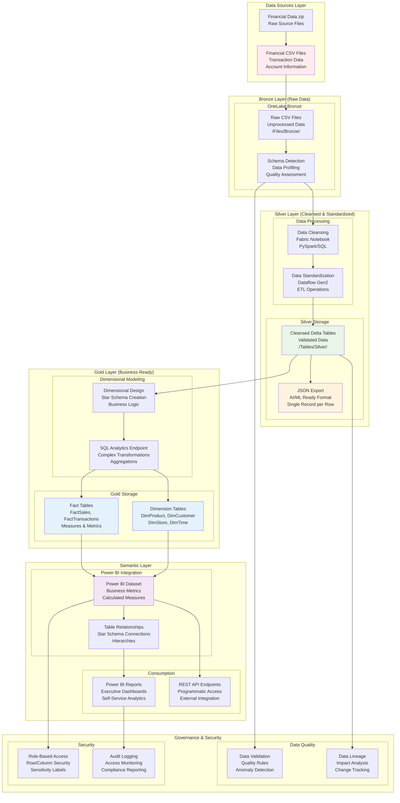

# 🔄 F02 - Data Engineering Challenge

**Implementing Medallion Architecture with Microsoft Fabric**

Welcome to the Data Engineering challenge! This challenge focuses on transforming raw data through a complete medallion architecture pipeline, from bronze ingestion to gold-layer semantic models ready for business intelligence and AI workloads.

## 📋 Table of Contents

- [🎯 Challenge Overview](#-challenge-overview)
- [🏆 Learning Objectives](#-learning-objectives)
- [🛠️ Prerequisites](#️-prerequisites)
- [📐 Architecture Overview](#-architecture-overview)
- [🚀 Challenge Steps](#-challenge-steps)
- [✅ Success Criteria](#-success-criteria)
- [🆘 Troubleshooting](#-troubleshooting)
- [📚 Additional Resources](#-additional-resources)

## 🎯 Challenge Overview

Transform raw financial CSV data into a production-ready semantic model using Microsoft Fabric's medallion architecture. This challenge demonstrates modern data engineering practices, dimensional modeling, and preparation of datasets for both business intelligence and AI/ML workloads.

### 🎯 What You'll Build
- Complete medallion architecture (Bronze → Silver → Gold)
- Dimensional data model with fact and dimension tables
- Semantic model ready for Power BI reporting
- JSON datasets optimized for AI/ML consumption

### ⏱️ Estimated Time
**2-3 hours** (depending on data complexity and modeling experience)

## 🏆 Learning Objectives

By completing this challenge, you will master:

✅ **Medallion Architecture** - Bronze, Silver, and Gold data layer implementation  
✅ **Data Transformation** - Cleansing, enrichment, and standardization techniques  
✅ **Dimensional Modeling** - Star schema design with facts and dimensions  
✅ **Semantic Layer** - Business-friendly models for analytics consumption  
✅ **Multi-Format Output** - CSV, Parquet, Delta, and JSON for different use cases  
✅ **Data Governance** - Security, quality, and lineage management  

## 🛠️ Prerequisites

### Completed Challenges
- **F01 - Fabric Configuration** - Must be completed first
- Financial CSV data uploaded to Bronze layer in OneLake

### Azure Requirements
- Active Microsoft Fabric workspace with assigned capacity
- Access to uploaded financial transaction data
- Permissions for lakehouse management and SQL operations

### Knowledge Prerequisites
- Understanding of data warehouse concepts
- Familiarity with SQL queries and data transformations
- Basic knowledge of dimensional modeling (facts vs dimensions)

## 📐 Architecture Overview

### 🏗️ Medallion Data Engineering Architecture



### 🔄 Architecture Components

**Bronze Layer (Raw Zone):**
- Ingested CSV files in original format
- Schema detection and data profiling
- Quality assessment and validation rules

**Silver Layer (Standardized Zone):**
- Cleansed and validated data
- Standardized formats and data types
- Delta Lake tables for ACID compliance
- JSON exports for AI/ML workflows

**Gold Layer (Curated Zone):**
- Dimensional model with star schema
- Fact tables containing business metrics
- Dimension tables with business context
- Optimized for analytical queries

**Semantic Layer:**
- Power BI datasets with business logic
- Calculated measures and hierarchies
- Row-level security and governance

## 🚀 Challenge Steps

### Step 1: Validate Bronze Layer Data 📊

**Objective:** Assess raw data quality and prepare for transformation pipeline

#### 1️⃣ Data Discovery
1. Navigate to **FinancialDataLakehouse** from F01 challenge
2. Access **Files** → **Bronze** → **FinancialData**
3. Validate uploaded CSV files:
   ```
   Expected Files:
   ├── transactions_2023.csv
   ├── transactions_2024.csv
   ├── account_data.csv
   └── customer_info.csv
   ```

#### 2️⃣ Data Profiling
1. Create new **Fabric Notebook** in workspace
2. Name: `01_Bronze_Data_Profiling`
3. Load and profile each CSV file:

```python
# Sample profiling code structure
import pandas as pd
from pyspark.sql import SparkSession

# Initialize Spark session
spark = SparkSession.builder.appName("DataProfiling").getOrCreate()

# Load CSV from OneLake
df = spark.read.csv("abfss://workspace@onelake.dfs.fabric.microsoft.com/FinancialDataLakehouse.Lakehouse/Files/Bronze/FinancialData/transactions_2023.csv", header=True, inferSchema=True)

# Profile data quality
print(f"Row Count: {df.count()}")
print(f"Column Count: {len(df.columns)}")
df.describe().show()
```

#### ✅ Success Checkpoint
- All CSV files accessible and readable
- Data quality metrics documented
- Schema validation completed
- Null values and anomalies identified

---

### Step 2: Build Silver Layer Pipeline 🔄

**Objective:** Create cleansed, standardized data ready for dimensional modeling

#### 1️⃣ Data Cleansing Notebook
1. Create **Fabric Notebook**: `02_Silver_Data_Cleansing`
2. Implement data cleaning operations:

```python
# Data cleansing pipeline
from pyspark.sql.functions import *
from pyspark.sql.types import *

# Read bronze data
transactions_df = spark.read.csv("path/to/bronze/transactions.csv", header=True, inferSchema=True)

# Data cleansing operations
clean_df = transactions_df \
    .dropna(subset=["transaction_id", "customer_id"]) \
    .filter(col("amount") > 0) \
    .withColumn("transaction_date", to_date(col("transaction_date"), "yyyy-MM-dd")) \
    .withColumn("amount", round(col("amount"), 2))

# Write to Silver layer as Delta table
clean_df.write.format("delta").mode("overwrite").saveAsTable("Silver_Transactions")
```

#### 2️⃣ Create JSON Export for AI Workloads
1. Add JSON export logic to notebook:

```python
# Export to JSON format for AI/ML workloads
json_df = clean_df.select("*")

# Write as single JSON file with one record per line
json_df.coalesce(1).write.format("json").mode("overwrite") \
    .save("abfss://workspace@onelake.dfs.fabric.microsoft.com/FinancialDataLakehouse.Lakehouse/Files/Silver/financial_data.json")
```

#### 3️⃣ Alternative: Use Dataflow Gen2
1. Create **Dataflow Gen2**: `Silver_Data_Pipeline`
2. Configure data transformation steps:
   - **Source**: Bronze CSV files
   - **Transform**: Clean nulls, standardize formats, validate ranges
   - **Destination**: Silver Delta tables

#### ✅ Success Checkpoint
- Clean Delta tables created in Silver layer
- JSON export generated for AI consumption
- Data validation rules applied successfully
- Transformation pipeline documented

---

### Step 3: Design Gold Layer Dimensional Model ⭐

**Objective:** Create star schema with fact and dimension tables for business analytics

#### 1️⃣ Dimensional Model Design
1. Create **Fabric Notebook**: `03_Gold_Dimensional_Model`
2. Design star schema structure:

```python
# Dimensional model design
# Fact Table: FactTransactions
fact_columns = ["transaction_key", "customer_key", "product_key", "store_key", 
                "date_key", "transaction_amount", "quantity", "discount_amount"]

# Dimension Tables
dim_customer_columns = ["customer_key", "customer_id", "customer_name", 
                       "city", "state", "country", "segment"]
dim_product_columns = ["product_key", "product_id", "product_name", 
                      "category", "subcategory", "brand"]
dim_store_columns = ["store_key", "store_id", "store_name", 
                    "store_city", "store_state", "region"]
dim_date_columns = ["date_key", "full_date", "year", "quarter", 
                   "month", "day", "day_of_week"]
```

#### 2️⃣ Implement Dimensional Tables
1. Create dimension tables with business keys:

```python
# Create DimCustomer
dim_customer = silver_customers_df \
    .withColumn("customer_key", monotonically_increasing_id()) \
    .select("customer_key", "customer_id", "customer_name", "city", "state", "country", "segment")

dim_customer.write.format("delta").mode("overwrite").saveAsTable("DimCustomer")

# Create DimProduct  
dim_product = silver_products_df \
    .withColumn("product_key", monotonically_increasing_id()) \
    .select("product_key", "product_id", "product_name", "category", "subcategory", "brand")

dim_product.write.format("delta").mode("overwrite").saveAsTable("DimProduct")

# Create FactTransactions with foreign keys
fact_transactions = silver_transactions_df \
    .join(dim_customer, "customer_id") \
    .join(dim_product, "product_id") \
    .join(dim_store, "store_id") \
    .join(dim_date, silver_transactions_df.transaction_date == dim_date.full_date) \
    .select("customer_key", "product_key", "store_key", "date_key", 
            "transaction_amount", "quantity", "discount_amount")

fact_transactions.write.format("delta").mode("overwrite").saveAsTable("FactTransactions")
```

#### 3️⃣ Create Date Dimension
1. Generate comprehensive date dimension:

```python
# Create comprehensive date dimension
from datetime import datetime, timedelta

def create_date_dimension(start_date, end_date):
    dates = []
    current_date = start_date
    date_key = 1
    
    while current_date <= end_date:
        dates.append({
            "date_key": date_key,
            "full_date": current_date,
            "year": current_date.year,
            "quarter": (current_date.month - 1) // 3 + 1,
            "month": current_date.month,
            "month_name": current_date.strftime("%B"),
            "day": current_date.day,
            "day_of_week": current_date.weekday(),
            "day_name": current_date.strftime("%A"),
            "is_weekend": current_date.weekday() >= 5
        })
        current_date += timedelta(days=1)
        date_key += 1
    
    return spark.createDataFrame(dates)

# Generate date dimension
start_date = datetime(2020, 1, 1)
end_date = datetime(2025, 12, 31)
dim_date = create_date_dimension(start_date, end_date)
dim_date.write.format("delta").mode("overwrite").saveAsTable("DimDate")
```

#### ✅ Success Checkpoint
- Star schema implemented with proper relationships
- Fact table contains business metrics
- Dimension tables provide business context
- Foreign key relationships established

---

### Step 4: Create Semantic Model 📈

**Objective:** Build Power BI-ready semantic layer with business logic

#### 1️⃣ SQL Analytics Endpoint Configuration
1. Navigate to lakehouse **SQL Analytics Endpoint**
2. Verify all Gold tables are accessible
3. Create views with business logic:

```sql
-- Create business-friendly view
CREATE VIEW vw_sales_summary AS
SELECT 
    dc.customer_name,
    dp.product_name,
    dp.category,
    ds.store_name,
    dd.year,
    dd.month_name,
    SUM(ft.transaction_amount) as total_sales,
    SUM(ft.quantity) as total_quantity,
    COUNT(ft.transaction_key) as transaction_count
FROM FactTransactions ft
JOIN DimCustomer dc ON ft.customer_key = dc.customer_key
JOIN DimProduct dp ON ft.product_key = dp.product_key  
JOIN DimStore ds ON ft.store_key = ds.store_key
JOIN DimDate dd ON ft.date_key = dd.date_key
GROUP BY dc.customer_name, dp.product_name, dp.category, 
         ds.store_name, dd.year, dd.month_name
```

#### 2️⃣ Power BI Semantic Model
1. Open **Power BI Desktop**
2. Connect to **Fabric SQL Analytics Endpoint**
3. Import dimensional tables:
   - FactTransactions (as fact table)
   - DimCustomer, DimProduct, DimStore, DimDate (as dimension tables)

#### 3️⃣ Configure Relationships
1. In Power BI **Model View**:
   - Create relationships between fact and dimension tables
   - Set cardinality: One (dimension) to Many (fact)
   - Configure cross-filter direction

#### 4️⃣ Create Measures
```dax
-- Sample DAX measures
Total Sales = SUM(FactTransactions[transaction_amount])
Total Quantity = SUM(FactTransactions[quantity])
Average Order Value = DIVIDE([Total Sales], COUNT(FactTransactions[transaction_key]))
Sales Growth = 
VAR CurrentYear = [Total Sales]
VAR PreviousYear = CALCULATE([Total Sales], DATEADD(DimDate[full_date], -1, YEAR))
RETURN DIVIDE(CurrentYear - PreviousYear, PreviousYear)
```

#### ✅ Success Checkpoint
- Power BI semantic model connected to Gold layer
- Relationships configured correctly
- Business measures created and tested
- Model optimized for report performance

---

### Step 5: Validate End-to-End Pipeline 🔍

**Objective:** Test complete data pipeline and ensure data quality

#### 1️⃣ Data Lineage Validation
1. Create validation notebook: `04_Pipeline_Validation`
2. Test data flow across all layers:

```python
# Validate data consistency across layers
bronze_count = spark.sql("SELECT COUNT(*) FROM bronze_transactions").collect()[0][0]
silver_count = spark.sql("SELECT COUNT(*) FROM silver_transactions").collect()[0][0]
gold_count = spark.sql("SELECT COUNT(*) FROM FactTransactions").collect()[0][0]

print(f"Bronze records: {bronze_count}")
print(f"Silver records: {silver_count}")  
print(f"Gold records: {gold_count}")

# Data quality checks
quality_checks = {
    "no_null_keys": spark.sql("SELECT COUNT(*) FROM FactTransactions WHERE customer_key IS NULL").collect()[0][0] == 0,
    "positive_amounts": spark.sql("SELECT COUNT(*) FROM FactTransactions WHERE transaction_amount <= 0").collect()[0][0] == 0,
    "valid_dates": spark.sql("SELECT COUNT(*) FROM FactTransactions WHERE date_key IS NULL").collect()[0][0] == 0
}

for check, passed in quality_checks.items():
    print(f"{check}: {'PASSED' if passed else 'FAILED'}")
```

#### 2️⃣ Business Logic Testing
1. Create sample Power BI report
2. Test key business scenarios:
   - Sales by product category
   - Customer segmentation analysis
   - Time-based trend analysis
   - Top performers identification

#### ✅ Success Checkpoint
- Data pipeline validation completed
- Quality checks passing
- Business reports generating expected results
- JSON files available for AI workloads

## ✅ Success Criteria

### 🎯 Technical Implementation

**Medallion Architecture:**
- [ ] Bronze layer with raw CSV data ingestion
- [ ] Silver layer with cleansed Delta tables
- [ ] Gold layer with dimensional star schema
- [ ] JSON exports optimized for AI/ML consumption

**Data Quality & Governance:**
- [ ] Data validation rules implemented
- [ ] Quality metrics documented and monitored
- [ ] Security roles and permissions configured
- [ ] Data lineage tracked across all layers

**Business Intelligence Ready:**
- [ ] Power BI semantic model deployed
- [ ] Table relationships configured correctly
- [ ] Business measures and calculations defined
- [ ] Sample reports demonstrate analytical capabilities

### 🏆 Challenge Completion Indicators

✅ **Semantic Model** accessible and functional in Power BI  
✅ **JSON Dataset** available for AI Challenge consumption  
✅ **Data Pipeline** processes data with quality validation  
✅ **Documentation** completed for team handover  

## 🆘 Troubleshooting

### Common Issues & Solutions

**🔴 Delta Table Creation Failures**
```
Problem: Cannot create Delta tables in Silver/Gold layers
Solution: 
- Verify lakehouse permissions (Admin role required)
- Check available compute capacity
- Ensure proper Spark session configuration
- Validate folder path permissions in OneLake
```

**🔴 Power BI Connection Issues**
```
Problem: Cannot connect Power BI to Fabric SQL Endpoint
Solution:
- Verify SQL Analytics Endpoint is active
- Check authentication credentials
- Ensure workspace access permissions
- Try direct SQL endpoint URL connection
```

**🔴 JSON Export Problems**
```
Problem: JSON files not generated or corrupted
Solution:
- Use coalesce(1) to create single output file
- Verify output path permissions
- Check for special characters in data
- Monitor Spark job execution logs
```

**🔴 Dimensional Model Issues**
```
Problem: Fact table relationships not working correctly
Solution:
- Verify foreign key integrity
- Check dimension table unique keys
- Validate join conditions in transformation logic
- Test with small dataset first
```

### 📞 Support Resources

**Microsoft Documentation:**
- [Fabric Data Engineering](https://learn.microsoft.com/en-us/fabric/data-engineering/)
- [Delta Lake in Fabric](https://learn.microsoft.com/en-us/fabric/data-engineering/delta-lake-overview)
- [Power BI Semantic Models](https://learn.microsoft.com/en-us/power-bi/connect-data/service-datasets-understand)

**Best Practices:**
- [Medallion Architecture](https://learn.microsoft.com/en-us/azure/databricks/lakehouse/medallion)
- [Dimensional Modeling](https://learn.microsoft.com/en-us/power-bi/guidance/star-schema)

## 📚 Additional Resources

### 🎓 Advanced Learning

**Data Engineering Patterns:**
- [Modern Data Warehouse Architecture](https://learn.microsoft.com/en-us/azure/architecture/example-scenario/data/modern-data-warehouse)
- [Data Mesh Concepts](https://learn.microsoft.com/en-us/azure/cloud-adoption-framework/scenarios/data-management/architectures/data-mesh)
- [Real-time Analytics](https://learn.microsoft.com/en-us/fabric/real-time-analytics/)

**Performance Optimization:**
- [Delta Lake Performance Tuning](https://learn.microsoft.com/en-us/fabric/data-engineering/delta-optimization-and-v-order)
- [Power BI Model Optimization](https://learn.microsoft.com/en-us/power-bi/guidance/import-modeling-data-reduction)

### 🔧 Development Tools

**Notebook Templates:**
```python
# Template for data transformation notebook
from pyspark.sql import SparkSession
from pyspark.sql.functions import *
from pyspark.sql.types import *
from delta import configure_spark_with_delta_pip

# Initialize Delta-enabled Spark session
spark = configure_spark_with_delta_pip(
    SparkSession.builder
    .appName("DataEngineering")
    .config("spark.sql.adaptive.enabled", "true")
    .config("spark.sql.adaptive.coalescePartitions.enabled", "true")
).getOrCreate()
```

**SQL Templates:**
```sql
-- Template for dimension table creation
CREATE TABLE DimProduct (
    product_key BIGINT GENERATED ALWAYS AS IDENTITY,
    product_id STRING NOT NULL,
    product_name STRING,
    category STRING,
    subcategory STRING,
    brand STRING,
    created_date TIMESTAMP DEFAULT CURRENT_TIMESTAMP(),
    updated_date TIMESTAMP DEFAULT CURRENT_TIMESTAMP()
) USING DELTA
TBLPROPERTIES (
    'delta.autoOptimize.optimizeWrite' = 'true',
    'delta.autoOptimize.autoCompact' = 'true'
);
```

### 🎯 Next Steps

**Immediate Actions:**
1. **Test your semantic model** with various business scenarios
2. **Document data lineage** for governance and compliance
3. **Set up monitoring** for data pipeline health
4. **Prepare datasets** for Day 2 AI challenges

**Advanced Extensions:**
- **Real-time streaming** data integration
- **Machine learning** model training on Gold data
- **Advanced analytics** with Python/R in Fabric
- **Data mesh** pattern implementation

---

## 🎯 Ready for Day 2 AI Challenges?

Your data engineering pipeline now provides:

**For AI Challenge 01 (RAG ChatBot):**
- JSON datasets ready for vector embedding
- Clean, structured data for knowledge base
- Optimized format for Azure AI Search indexing

**For AI Challenge 02 (Intelligent Agent):**
- Dimensional model for recommendation algorithms
- Customer and product relationships established
- Real-time data access through SQL endpoints

**Congratulations on completing the Data Engineering challenge! 🚀**

---

*Built with ❤️ for the Dallas MTC Fabric Hackathon - October 2025*