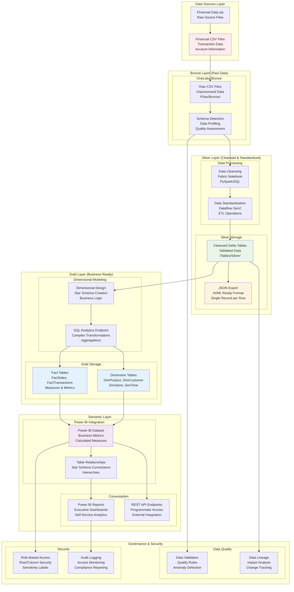

# F02 - Data Engineering Challenge - Implementing Medallion Architecture with Microsoft Fabric

Welcome to the Data Engineering challenge! This challenge focuses on transforming raw data through a complete medallion architecture, from bronze ingestion to silver-layer and modeling data for business intelligence and AI workloads.

- [🎯 Challenge Overview](#-challenge-overview)
- [🏆 Learning Objectives](#-learning-objectives)
- [🛠️ Prerequisites](#️-prerequisites)
- [📐 Architecture Overview](#-architecture-overview)
- [🚀 Challenge Steps](#-challenge-steps)
- [✅ Success Criteria](#-success-criteria)
- [🆘 Troubleshooting](#-troubleshooting)
- [📚 Additional Resources](#-additional-resources)

## 📖 Challenge Overview  

In this challenge, you will:  

✅ Use two JSON data sources for source data. One uploaded directly to Fabric, and the other in a NoSQL instance.  
✅ Set up an **Upload JSON to Fabric**  
✅ Create a CosmosDB instance and **upload JSON to COSMOSDB**  
✅ Move the data through a **Medallion Data Architecture** to a Silver staging layer for use in Challenge 3  
✅ Assign **permissions**   
✅ **Produce a CSV version of the JSON file** for use with the AI workshop in day 2  

---

### ⏱️ Estimated Time
**2-3 hours** (depending on data complexity and modeling experience)

---

## 🏆 Learning Objectives

By completing this challenge, you will master:

✅ **Medallion Architecture** - Bronze, Silver, and Gold data layer implementation  
✅ **Data Transformation** - Cleansing, enrichment, and standardization techniques  
✅ **Multi-Format Output** - CSV, Parquet, Delta, and JSON for different use cases  
✅ **Data Governance** - Security, quality, and lineage management  


---

## 🛠️ Prerequisites

### Completed Challenges
- **F01 - Fabric Configuration** - Must be completed first
- Financial CSV data uploaded to Bronze layer in OneLake

### Azure Requirements
- Active Microsoft Fabric workspace with assigned capacity
- Access to uploaded financial transaction data
- Permissions for lakehouse management and SQL operations

### Knowledge Prerequisites
- Understanding of data warehouse concepts
- Familiarity with SQL queries and data transformations
- Basic knowledge of dimensional modeling (facts vs dimensions)

## 📐 Architecture Overview

### 🏗️ Medallion Data Engineering Architecture



### 🔄 Architecture Components

**CosmosDB Datasource**

**Bronze Layer (Raw Zone):**
- Ingested JSON files in original format
- Schema detection and data profiling
- Quality assessment and validation rules

**Silver Layer (Standardized Zone):**
- Cleansed and validated data
- Standardized formats and data types
- Delta Lake tables for ACID compliance
- CSV exports for AI/ML workflows

## 🚀 Challenge Steps


---

**🧩 Challenge Steps & Outcomes**
1. Upload the JSON to Fabric (Bronze Layer)
Challenge:
Ingest the raw JSON file into Microsoft Fabric

**Expected Outcome:**
•	JSON file stored in the Lakehouse Files section
•	Folder structure follows naming conventions (e.g., /bronze/retail_data/)


**Pointers**:
- Use **OneLake** for unified storage
- Validate schema and file integrity
- Consider using **Data Activator** for real-time alerts if applicable

---

### 2. Move the JSON Data to Silver Staging Layer

**Challenge**:  
Cleanse and enrich the data, then store it in the Silver layer as a structured format (e.g., Parquet or Delta).

**Considerations**:
- Does the data require validation? Nulls removed, formats standardized
- Stored in `/silver/` as Delta tables

**Pointers**:
- Use **Notebooks** or **Dataflows Gen2** for transformation
- Consider converting to **JSON** if required for downstream compatibility

---

### 3. Create a CosmosDB NoSQL instance

**Challenge**:  
Create a CosmosDB no SQL instance to be used for the second data source in this challenge.

**Expected Outcome**:
- CosmosDB create with NoSQL container

**Pointers**:
- Apply **role-based access control (RBAC)**


---

### 4. Upload the Sample JSON Data

**Challenge**:  
 Upload the sample data to finish creating the second data source for Fabric

**Expected Outcome**:
- JSON data uploaded successfully to the NoSQL database ready to be used as a Fabric datasource
- What is a logical partition ID?

---

### 5. Build the Data Integration from CosmosDB to Fabric

**Challenge**:  Using the newly uploaded data in CosmosDB, move this data to Fabric with the end goal of landing this data in a structured format in our silver layer.

**Expected Outcome**:
- Both JSON files will now be in Fabric in a silver layer and ready for transformation and modeling in the Gold layer.


---

### 6. Create a CSV file for Data Science

**Challenge:** Using a file from Fabric location, transform to a single JSON file containing one record for each row of the CSV. Store this file in the silver layer of the medallion architecture.


---

## 🔐 Security & Governance Considerations

- Enable **sensitivity labels** and **data loss prevention (DLP)** policies
- Use **Microsoft Purview** for data cataloging and compliance
- Audit access and transformations using Fabric’s built-in monitoring tools


## 🛠️ Technology Stack

- **Microsoft Fabric**: Lakehouse, Dataflows Gen2, Notebooks, Power BI
- **Storage Format**: CSV → Delta/Parquet → Semantic Model
- **Security**: Entra ID, RBAC, Purview
- **Optional Enhancements**: Data Activator, Power BI Copilot, Data Agents

---

## 🏁 Final Deliverable

A staged, silver relational model, ready for dimensional modeling and reporting. Participants should be able to explain each transformation step and justify their technology choices.


---

## 🏁 Final Challenge Checkpoints  
✅ Silver layer data is created.
✅ JSON file is created and ready for use in AI tasks 

---

Once all steps are completed, you are ready to move on to **Challenge 3! 🚀**  

---

## 🆘 Troubleshooting

### Common Issues & Solutions

**🔴 Delta Table Creation Failures**
```
Problem: Cannot create Delta tables in Silver/Gold layers
Solution: 
- Verify lakehouse permissions (Admin role required)
- Check available compute capacity
- Ensure proper Spark session configuration
- Validate folder path permissions in OneLake
```

**🔴 Power BI Connection Issues**
```
Problem: Cannot connect Power BI to Fabric SQL Endpoint
Solution:
- Verify SQL Analytics Endpoint is active
- Check authentication credentials
- Ensure workspace access permissions
- Try direct SQL endpoint URL connection
```

**🔴 JSON Export Problems**
```
Problem: JSON files not generated or corrupted
Solution:
- Use coalesce(1) to create single output file
- Verify output path permissions
- Check for special characters in data
- Monitor Spark job execution logs
```

**🔴 Dimensional Model Issues**
```
Problem: Fact table relationships not working correctly
Solution:
- Verify foreign key integrity
- Check dimension table unique keys
- Validate join conditions in transformation logic
- Test with small dataset first
```

### 📞 Support Resources

**Microsoft Documentation:**
- [Fabric Data Engineering](https://learn.microsoft.com/en-us/fabric/data-engineering/)
- [Delta Lake in Fabric](https://learn.microsoft.com/en-us/fabric/data-engineering/delta-lake-overview)
- [Power BI Semantic Models](https://learn.microsoft.com/en-us/power-bi/connect-data/service-datasets-understand)

**Best Practices:**
- [Medallion Architecture](https://learn.microsoft.com/en-us/azure/databricks/lakehouse/medallion)
- [Dimensional Modeling](https://learn.microsoft.com/en-us/power-bi/guidance/star-schema)

## 📚 Additional Resources

### 🎓 Advanced Learning

**Data Engineering Patterns:**
- [Modern Data Warehouse Architecture](https://learn.microsoft.com/en-us/azure/architecture/example-scenario/data/modern-data-warehouse)
- [Data Mesh Concepts](https://learn.microsoft.com/en-us/azure/cloud-adoption-framework/scenarios/data-management/architectures/data-mesh)
- [Real-time Analytics](https://learn.microsoft.com/en-us/fabric/real-time-analytics/)

**Performance Optimization:**
- [Delta Lake Performance Tuning](https://learn.microsoft.com/en-us/fabric/data-engineering/delta-optimization-and-v-order)
- [Power BI Model Optimization](https://learn.microsoft.com/en-us/power-bi/guidance/import-modeling-data-reduction)

### 🔧 Development Tools

**Notebook Templates:**
```python
# Template for data transformation notebook
from pyspark.sql import SparkSession
from pyspark.sql.functions import *
from pyspark.sql.types import *
from delta import configure_spark_with_delta_pip

# Initialize Delta-enabled Spark session
spark = configure_spark_with_delta_pip(
    SparkSession.builder
    .appName("DataEngineering")
    .config("spark.sql.adaptive.enabled", "true")
    .config("spark.sql.adaptive.coalescePartitions.enabled", "true")
).getOrCreate()
```

**SQL Templates:**
```sql
-- Template for dimension table creation
CREATE TABLE DimProduct (
    product_key BIGINT GENERATED ALWAYS AS IDENTITY,
    product_id STRING NOT NULL,
    product_name STRING,
    category STRING,
    subcategory STRING,
    brand STRING,
    created_date TIMESTAMP DEFAULT CURRENT_TIMESTAMP(),
    updated_date TIMESTAMP DEFAULT CURRENT_TIMESTAMP()
) USING DELTA
TBLPROPERTIES (
    'delta.autoOptimize.optimizeWrite' = 'true',
    'delta.autoOptimize.autoCompact' = 'true'
);
```

### 🎯 Next Steps

**Immediate Actions:**
1. **Test your semantic model** with various business scenarios
2. **Document data lineage** for governance and compliance
3. **Set up monitoring** for data pipeline health
4. **Prepare datasets** for Day 2 AI challenges

**Advanced Extensions:**
- **Real-time streaming** data integration
- **Machine learning** model training on Gold data
- **Advanced analytics** with Python/R in Fabric
- **Data mesh** pattern implementation

---

## 🎯 Ready for Day 2 AI Challenges?

Your data engineering pipeline now provides:

**For AI Challenge 01 (RAG ChatBot):**
- JSON datasets ready for vector embedding
- Clean, structured data for knowledge base
- Optimized format for Azure AI Search indexing

**For AI Challenge 02 (Intelligent Agent):**
- Dimensional model for recommendation algorithms
- Customer and product relationships established
- Real-time data access through SQL endpoints

**Congratulations on completing the Data Engineering challenge! 🚀**

---

*Built with ❤️ for the Dallas MTC Fabric Hackathon - October 2025*
