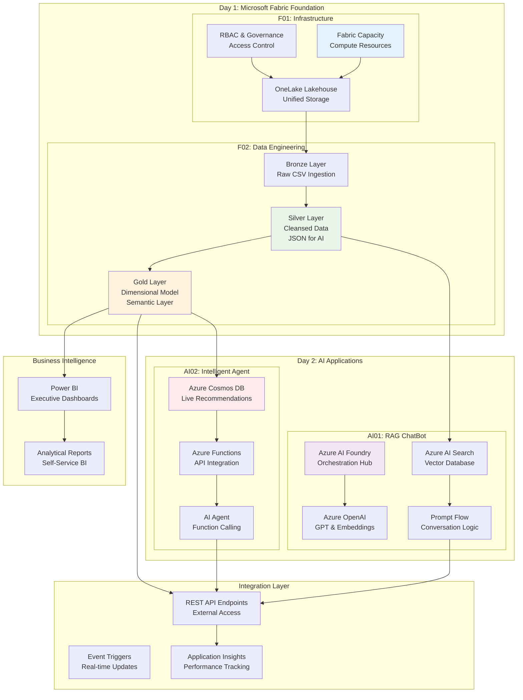

# 🚀 Dallas MTC Hackathon - October 2025

**Two-Day Data & AI Innovation Challenge**

Welcome to the comprehensive two-day hackathon designed to showcase the power of Microsoft Fabric and Azure AI services! This event combines modern data engineering practices with cutting-edge AI capabilities to build end-to-end intelligent applications.


## 📋 Table of Contents

- [🎯 Event Overview](#-event-overview)
- [📅 Event Schedule](#-event-schedule)
- [🏗️ Repository Structure](#️-repository-structure)
- [📐 Overall Architecture](#-overall-architecture)
- [🚀 Getting Started](#-getting-started)
- [📚 Challenge Details](#-challenge-details)
- [🎯 Learning Paths](#-learning-paths)
- [📄 Documentation & Licensing](#-documentation--licensing)
- [🆘 Support & Resources](#-support--resources)

## 🎯 Event Overview

This hackathon demonstrates the complete journey from raw data to intelligent AI applications, showcasing how Microsoft Fabric and Azure AI services work together to create powerful, scalable solutions.

### 🎨 What You'll Experience
- **Day 1**: Foundation data platform using Microsoft Fabric
- **Day 2**: AI-powered applications leveraging your data platform
- **Integration**: See how data engineering enables advanced AI scenarios

### 🏆 Key Technologies
- **Microsoft Fabric** - Unified data platform
- **Azure AI Foundry** - AI application orchestration
- **Azure OpenAI** - Large language models
- **Power BI** - Business intelligence and reporting
- **Azure AI Search** - Vector and hybrid search

## 📅 Event Schedule

### 🗓️ Day 1: Microsoft Fabric Foundation
**Focus: Building Modern Data Platform**

| **Time** | **Activity** | **Challenge** | **Focus Area** |
|----------|--------------|---------------|----------------|
| **9:00 AM - 9:30 AM** | Welcome & Setup | - | Azure environment preparation |
| **9:30 AM - 11:30 AM** | **F01 Challenge** | Fabric Configuration | Infrastructure & storage setup |
| **11:30 AM - 12:00 PM** | Break & Networking | - | Team collaboration |
| **12:00 PM - 2:00 PM** | **F02 Challenge** | Data Engineering | Medallion architecture pipeline |
| **2:00 PM - 3:00 PM** | Lunch Break | - | Recharge & discussions |
| **2:00 PM - 3:30 PM** | **F03 Challenge** | Data Modeling | Semantic layers & dimensional design |
| **3:30 PM - 4:30 PM** | **F04 Bonus Challenge** | Real-time Analytics | Advanced streaming & KQL |
| **4:30 PM - 5:00 PM** | Day 1 Wrap-up | - | Prepare for Day 2 |

### 🗓️ Day 2: AI Application Development
**Focus: Intelligent Applications**

| **Time** | **Activity** | **Challenge** | **Focus Area** |
|----------|--------------|---------------|----------------|
| **9:00 AM - 9:30 AM** | Day 2 Kickoff | - | AI strategy overview |
| **9:30 AM - 12:00 PM** | **AI01 Challenge** | RAG ChatBot | Conversational AI with custom data |
| **12:00 PM - 1:00 PM** | Lunch Break | - | Mid-event networking |
| **12:00 PM - 2:00 PM** | **AI02 Challenge** | Intelligent Agent | Database-connected AI agents |
| **2:00 PM - 3:30 PM** | **AI03 Challenge** | Multi-Agent System | Advanced multi-agent orchestration |
| **3:30 PM - 4:00 PM** | Integration & Testing | - | End-to-end solution validation |
| **4:00 PM - 4:30 PM** | Final Presentations | - | Show your achievements |
| **4:30 PM - 5:00 PM** | Closing & Awards | - | Celebrate success |

## 🏗️ Repository Structure

```
HackathonOct25/
├── README.md                                    # 📖 This main guide
├── LICENSE                                      # 📄 MIT License for code
├── LICENSE_DOCS                                 # 📄 CC Attribution 4.0 for docs
├── Prerequisites.md                             # 🔧 Setup requirements & preparation
│
├── 🗓️ DAY 1: MICROSOFT FABRIC CHALLENGES
├── F01 - Fabric Configuration/                 # ⚙️ Foundation setup
│   ├── challenge.md                        # Original challenge document
│   └── solution.md                         # Detailed solution walkthrough
│
├── F02 - Data Engineering/                     # 🔄 Data pipeline creation
│   └── challange.md                           # Original challenge specification
│   └── solution.md                         # Detailed solution walkthrough
│
├── F03 - Data Modeling/                     # 🔄 Data model creation
│   └── challange.md                           # Original challenge specification
│   └── solution.md                         # Detailed solution walkthrough
│
├── F04 - Bonus Challange - Realtime Analytics/                     # 🔄 Realtime Analytics Solution
│   ├── README.md                              # Complete engineering guide
│   └── Assets
│   │   ├── Image files                   # guide images
│   └── dashboards/RTA dashboard
│   │   ├── KQL and JSON files                   # dashboard files
│   └── Docs
│   │   ├── additional workshop guides                 # workshop.md
│   └── drawings
│   │   ├── Excalidraw files                   # diagram files
│   └── kql
│   │   ├── sample kql files                   # diagram files
│   └── notebooks
│   │   ├── sample notebook files                   # diagram files
│   └── sql
│   │   ├── sample sql files                   # diagram files
│   ├── CODE_OF_CONDUCT.md                        
│   ├── LICENSE                             
│   ├── Security.md                           
│   ├── requirements.md                     
│
│
│
├── 🗓️ DAY 2: AI APPLICATION CHALLENGES  
├── AI_Challenges/                              # 🤖 AI development workspace
│   ├── README.md                              # Complete AI challenges guide with architecture
│   ├── AI01-ChatBot/                          # 💬 RAG conversational AI
│   │   ├── 01-challenge.md                    # RAG implementation guide
│   │   ├── 01-solution.md                     # Solution methodology
│   │   └── Reference Pictures/                # Visual guides & screenshots
│   ├── AI02-Agent/                            # 🧠 Intelligent agent system
│   │   ├── 02-challenge.md                    # Agent development guide
│   │   ├── 02-solution.md                     # Implementation approach
│   │   ├── FuncAPP/                           # Azure Functions code
│   │   │   ├── function_app_v2.py             # Main function implementation
│   │   │   ├── host.json                      # Function app configuration
│   │   │   ├── requirements.txt               # Python dependencies
│   │   │   └── GetRecommendations/            # Recommendation service
│   │   │       ├── __init__.py                # Function implementation
│   │   │       └── function.json              # Function configuration
│   │   └── Reference Pictures/                # Architecture diagrams
│   ├── AI03-Multi_Agent/                      # 🔥 Advanced multi-agent system
│   │   ├── 03-challenge.md                    # Multi-agent challenge guide
│   │   └── 03-solution.md                     # 5-milestone implementation approach
│   ├── AI_Scripts/                            # 🛠️ Helper utilities
│   │   ├── csv_json_chal02.py                 # Data conversion scripts
│   │   ├── csv_json_flat_productname.py       # Flattening utilities
│   │   └── csv_json_group_by_product.py       # Grouping algorithms
│   └── Challenge02_artifacts/                  # 📦 Sample datasets
│       ├── recommendations.json               # Recommendation data
│       └── tailwind_traders_challange2_data.csv # Business data
│
├── 🗂️ DATA RESOURCES
├── Data/                                       # 📊 Core datasets
│   ├── financial data.zip                     # Primary data source
│   ├── tailwind_traders_challange2_data.csv   # Business transactions
│   └── tailwind_traders_retail_data.csv       # Retail analytics data
│
├── CSV/                                        # 📄 Processed CSV files
├── JSON_ByProd/                               # 🔢 Product-grouped JSON
├── JSON_Flat_Prod/                            # 📋 Flattened JSON format
├── TXT/                                       # 📝 Text-optimized for AI
│
└── Architecture/                              # 🏛️ Reference architectures
    └── onelake-medallion-lakehouse-architecture-example.png
```

### 📁 Folder Usage Guide

**Day 1 Participants:**
- Start with `F01 - Fabric Configuration/01-challenge.md`
- Progress to `F02 - Data Engineering/challange.md`
- Progress to F03 - Data Modeling/challange.md
- Use `Architecture/` for reference diagrams

**Day 2 Participants:**
- Begin with `AI_Challenges/README.md` for overview
- Follow `AI01-ChatBot/01-challenge.md` for first AI challenge
- Advance to `AI02-Agent/02-challenge.md` for intelligent agents
- Utilize `Data/`, `CSV/`, `JSON_*/`, `TXT/` folders for datasets

**Both Days (Full Experience):**
- Complete Day 1 challenges to prepare optimal datasets for Day 2
- JSON exports from F02 directly feed AI challenges
- Semantic models enable advanced AI scenarios

## 📐 Overall Architecture

### 🏗️ End-to-End Solution Architecture



### 🔄 Data & AI Integration Points

**Fabric → AI Integration:**
1. **JSON Datasets** from Silver layer feed AI Search indexing
2. **Dimensional Models** provide structured context for AI agents
3. **Real-time endpoints** enable live AI-data connections
4. **Power BI integration** visualizes AI insights and recommendations

**Cross-Day Benefits:**
- **Day 1 foundations** optimize Day 2 AI performance
- **Medallion architecture** provides clean, reliable AI training data
- **Semantic models** enable business-context-aware AI responses
- **Unified security** model spans data and AI applications

## 🚀 Getting Started

### 🎯 Choose Your Journey

#### 🆕 New to Microsoft Fabric?
**Recommended Path: Complete Both Days**
1. Start with **F01** to understand Fabric fundamentals
2. Progress to **F02** for hands-on data engineering
3. Advance to **AI01** for your first AI application
4. Complete **AI02** for advanced agent development

#### 🔄 Experienced with Data Platforms?
**Fast Track Option: Focus on Integration**
1. Quick review of **F01** for Fabric-specific concepts
2. Deep dive into **F02** medallion architecture
3. Leverage prepared datasets for **AI01** & **AI02**

#### 🤖 AI-First Approach?
**Start with Day 2 (with prepared data)**
1. Use provided datasets in `Data/`, `CSV/`, `JSON_*/` folders
2. Begin with **AI_Challenges/README.md** overview
3. Complete **AI01** and **AI02** using sample data
4. Consider Day 1 for production-ready data pipelines

### ⚙️ Environment Setup

> 📋 **Comprehensive Setup Guide**: See [`Prerequisites.md`](Prerequisites.md) for detailed environment preparation, Azure service configuration, and development tools setup.

#### Quick Requirements Summary

**Azure Services (Required):**
- Azure Subscription (Contributor+ permissions)
- Microsoft Fabric Capacity or Free Trial
- Azure OpenAI (GPT-35-Turbo quota: 120k TPM)
- Azure AI Services (for embeddings and search)

**Development Tools:**
- Visual Studio Code with Azure extensions
- Power BI Desktop (free)
- Python 3.8+ with AI libraries
- Git for repository management

**Optional Enhancements:**
- Azure Cosmos DB (for advanced agent scenarios)
- Azure Functions (for API integration)
- Power BI Pro (for advanced reporting)

💡 **Pro Tip**: Follow the [`Prerequisites.md`](Prerequisites.md) checklist to ensure smooth hackathon experience!

### 🏁 Quick Start Checklist

**Day 1 Preparation:**
- [ ] Azure subscription validated with sufficient quota
- [ ] Fabric workspace created or free trial activated
- [ ] Financial data ZIP file downloaded locally
- [ ] Development environment configured

**Day 2 Preparation:**
- [ ] Completed Day 1 challenges (or using sample data)
- [ ] Azure AI Foundry project created
- [ ] OpenAI resource deployed with required models
- [ ] Python development environment tested

## 📚 Challenge Details

### 🗓️ Day 1: Microsoft Fabric Challenges

#### 🏗️ F01 - Fabric Configuration (1-2 hours)
**Foundation Infrastructure Setup**

**What You'll Build:**
- Microsoft Fabric capacity provisioning
- OneLake lakehouse with proper governance
- Secure data ingestion pipeline
- RBAC and access control configuration

**Key Skills:** Azure resource management, data governance, security configuration

**Prerequisites:** Azure subscription, basic cloud knowledge

**Success Criteria:** Operational lakehouse with ingested financial data ready for processing

---

#### 🔄 F02 - Data Engineering & F03 - Data Modeling(2-3 hours)
**Medallion Architecture Implementation**

**What You'll Build:**
- Bronze → Silver → Gold data transformation pipeline
- Dimensional star schema with facts and dimensions
- Power BI semantic model for business intelligence
- JSON datasets optimized for AI consumption

**Key Skills:** Data transformation, dimensional modeling, ETL/ELT patterns, business intelligence

**Prerequisites:** F01 completed, SQL knowledge, understanding of data warehousing concepts

**Success Criteria:** Functional semantic model and AI-ready JSON datasets

---

### 🗓️ Day 2: AI Application Challenges

#### 🤖 AI01 - RAG ChatBot (3-4 hours)
**Conversational AI with Custom Data**

**What You'll Build:**
- Retrieval-Augmented Generation (RAG) chatbot
- Vector search with Azure AI Search
- Prompt Flow orchestration with conversation history
- Production-ready chat application

**Key Skills:** Vector databases, embedding models, prompt engineering, conversation design

**Prerequisites:** Basic AI concepts, JSON data from Day 1 (or sample data)

**Success Criteria:** Functional chatbot answering domain-specific questions with accurate, grounded responses

---

#### 🧠 AI02 - Intelligent Agent (2-3 hours)
**Database-Connected AI Agent**

**What You'll Build:**
- AI agent with function calling capabilities
- Azure Cosmos DB integration for real-time data
- Azure Functions API layer
- Dynamic recommendation system

**Key Skills:** Function calling, API integration, database connectivity, agent orchestration

**Prerequisites:** AI01 completed, understanding of APIs and databases

**Success Criteria:** AI agent providing real-time recommendations from live database queries

---

#### 🔥 AI03 - Multi-Agent System (3-4 hours)
**Advanced Multi-Agent AI System**

**What You'll Build:**
- **5 Specialized AI Agents** working in harmony (Intent Detector, Inventory, Alternatives, Recommendations, Response Formatter)
- **Advanced Conversation Memory** that persists across sessions
- **Smart Context Switching** with confirmatory response handling
- **Production-ready VS Code terminal application** with comprehensive testing
- **Beautiful Console Interface** with rich formatting and analytics

**Challenge Structure** (5 Milestones):
1. **Project Setup and Configuration** - Agent architecture design and Azure service integration
2. **Multi-Agent System Implementation** - Core orchestration system development
3. **Test Implementation & Unit Testing** - Comprehensive testing of agent interactions
4. **Production Application Testing** - VS Code terminal testing and validation
5. **Enhanced Features & Production Readiness** - Advanced features and enterprise capabilities

**Key Skills:** Multi-agent orchestration, conversation memory, production testing, enterprise AI patterns

**Prerequisites:** AI01 and AI02 completed, Python 3.12, understanding of agent frameworks

**Success Criteria:** Production-ready multi-agent system with natural conversation flow, memory persistence, and comprehensive testing validation

## 🎯 Learning Paths

### 🎓 Skill Development Tracks

#### **Data Engineering Track**
```
F01: Infrastructure → F02: Pipelines → Power BI Integration
Focus: Medallion architecture, dimensional modeling, semantic layers
Time Investment: 4-5 hours
Best For: Data engineers, analytics engineers, BI developers
```

#### **AI Development Track**
```
AI01: RAG Systems → AI02: Intelligent Agents → AI03: Advanced Patterns  
Focus: Vector search, prompt engineering, agent frameworks
Time Investment: 6-8 hours
Best For: AI engineers, application developers, data scientists
```

#### **Full Stack Track**
```
F01 → F02 → AI01 → AI02 (Complete Experience)
Focus: End-to-end data and AI integration
Time Investment: 8-10 hours
Best For: Solution architects, technical leads, full-stack developers
```

#### **Business Intelligence Track**
```
F01 → F02 → Power BI Deep Dive → AI01 (Business Context)
Focus: Self-service analytics, semantic modeling, business intelligence
Time Investment: 5-6 hours  
Best For: Business analysts, BI developers, citizen developers
```

### 🏆 Certification & Recognition

**Challenge Completion Badges:**
- 🏗️ **Fabric Foundation** - F01 completed
- 🔄 **Data Engineering** - F02 completed
- � **Data Modeling Expert** - F03 completed
- ⚡ **Real-time Analytics** - F04 completed
- 🤖 **AI Application Builder** - AI01 completed
- 🧠 **Intelligent Agent Developer** - AI02 completed
- 🔥 **Multi-Agent Architect** - AI03 completed
- 🚀 **Full Stack AI Master** - All challenges completed

**Special Recognition:**
- **Innovation Award** - Most creative implementation
- **Integration Excellence** - Best cross-day integration
- **Technical Depth** - Most advanced technical solution

## 📄 Documentation & Licensing

### 📚 Complete Documentation Suite

**Core Documentation:**
- [`README.md`](README.md) - Main hackathon guide (this file)
- [`Prerequisites.md`](Prerequisites.md) - Comprehensive setup requirements
- [`AI_Challenges/README.md`](AI_Challenges/README.md) - Complete AI challenges guide with detailed architecture diagrams

**Challenge-Specific Guides:**
- [`F01 - Fabric Configuration/README.md`](F01%20-%20Fabric%20Configuration/README.md) - Infrastructure setup guide
- [`F02 - Data Engineering/README.md`](F02%20-%20Data%20Engineering/README.md) - Data pipeline engineering guide

### ⚖️ Licensing Information

**Code Components:**
- **License**: MIT License
- **File**: [`LICENSE`](LICENSE)
- **Coverage**: All code, scripts, Azure Functions, and technical implementations
- **Rights**: Free to use, modify, distribute, and create derivative works

**Documentation & Educational Content:**
- **License**: Creative Commons Attribution 4.0 International (CC BY 4.0)
- **File**: [`LICENSE_DOCS`](LICENSE_DOCS)
- **Coverage**: README files, tutorials, guides, and educational materials
- **Rights**: Free to share and adapt with attribution

**Attribution Requirements:**
```
Code Attribution:
Original work by Microsoft Dallas MTC Hackathon - October 2025
Licensed under MIT License

Documentation Attribution:
Original documentation by Microsoft Dallas MTC Hackathon - October 2025
Licensed under CC BY 4.0
```

**Using This Repository:**
- ✅ **Educational Use**: Freely use for learning and training
- ✅ **Commercial Projects**: Adapt code for business applications
- ✅ **Community Sharing**: Share improvements and extensions
- ✅ **Internal Training**: Use within organizations for skill development

## 🆘 Support & Resources

### 📞 Getting Help

#### During the Event
- **Technical Support:** On-site mentors for hands-on assistance
- **Challenge Guides:** Comprehensive documentation in each folder
- **Peer Learning:** Collaborative troubleshooting with other participants
- **Live Q&A:** Regular check-ins with expert facilitators

#### Self-Service Resources
- **Challenge README files** with step-by-step instructions
- **Reference Pictures** folders with visual guidance
- **Sample Code** in AI_Scripts and FuncAPP directories
- **Architecture Diagrams** showing solution patterns

### 📚 Documentation & Learning

#### Microsoft Official Documentation
- [Microsoft Fabric Documentation](https://learn.microsoft.com/en-us/fabric/)
- [Azure AI Foundry Documentation](https://learn.microsoft.com/en-us/azure/ai-studio/)
- [Azure OpenAI Service](https://learn.microsoft.com/en-us/azure/ai-services/openai/)
- [Power BI Documentation](https://learn.microsoft.com/en-us/power-bi/)

#### Specialized Guides
- [Medallion Architecture Patterns](https://learn.microsoft.com/en-us/azure/databricks/lakehouse/medallion)
- [RAG Implementation Best Practices](https://learn.microsoft.com/en-us/azure/ai-services/openai/concepts/use-your-data)
- [AI Agent Development](https://learn.microsoft.com/en-us/azure/ai-services/openai/how-to/function-calling)

### 🔧 Troubleshooting Quick Reference

#### Common Issues & Solutions

**🔴 Fabric Capacity Issues**
```
Problem: Insufficient capacity or assignment failures
Quick Fix: 
- Verify Azure subscription limits
- Check region availability
- Use Fabric free trial for development
```

**🔴 Data Pipeline Errors**
```
Problem: ETL transformations failing
Quick Fix:
- Validate input data schemas
- Check compute resource availability  
- Review transformation logic in notebooks
```

**🔴 AI Service Connectivity**
```
Problem: Cannot connect to Azure OpenAI or AI Search
Quick Fix:
- Verify service deployment and endpoints
- Check API keys and authentication
- Validate network connectivity and firewall rules
```

**🔴 Performance Issues**
```
Problem: Slow query execution or model responses
Quick Fix:
- Review data partitioning strategies
- Optimize vector index configurations
- Consider compute scaling options
```

### 🎯 Success Tips

#### **Pre-Event Preparation:**
- **Complete Prerequisites** - Follow [`Prerequisites.md`](Prerequisites.md) setup checklist
- **Validate Environment** - Test all Azure services and development tools
- **Review Architecture** - Study the comprehensive diagrams in [`AI_Challenges/README.md`](AI_Challenges/README.md)
- **Understand Licensing** - Review [`LICENSE`](LICENSE) (MIT) and [`LICENSE_DOCS`](LICENSE_DOCS) (CC Attribution 4.0) for complete usage rights

#### **Day 1 Success Strategies:**
- **Start Simple** - Focus on getting basic pipeline working first
- **Validate Early** - Test each layer before proceeding to next
- **Document Decisions** - Note configuration choices for Day 2 integration
- **Plan for Scale** - Consider production requirements in design

#### **Day 2 Success Strategies:**
- **Leverage Day 1 Work** - Use your prepared datasets for best AI performance
- **Experiment with Prompts** - Iterate on prompt engineering for better responses
- **Test Incrementally** - Verify each AI component before integrating
- **Monitor Quotas** - Watch OpenAI usage limits during development

#### **Cross-Day Integration:**
- **Data Quality Focus** - Clean Day 1 data improves Day 2 AI accuracy
- **Security Consistency** - Align access controls across data and AI layers
- **Performance Planning** - Consider end-to-end latency requirements
- **Business Context** - Ensure AI applications serve real business needs

---

## 🎉 Ready to Begin?

### 🚀 Your Next Steps

1. **Review Architecture** - Understand how all pieces connect
2. **Set Up Environment** - Prepare Azure resources and development tools
3. **Choose Your Path** - Select learning track that matches your goals
4. **Start with F01** - Begin your hackathon journey!

### 🤝 Community & Collaboration

- **Share Your Progress** - Use repository discussions to connect with other participants
- **Document Innovations** - Contribute improvements back to the community
- **Extend the Challenges** - Build upon the foundation with your own creative solutions

**Welcome to the future of data and AI integration! Let's build something amazing together. 🚀**

---

*Crafted with ❤️ for the Dallas MTC Hackathon - October 2025*
*Microsoft Fabric ❤️ Azure AI - Better Together*
